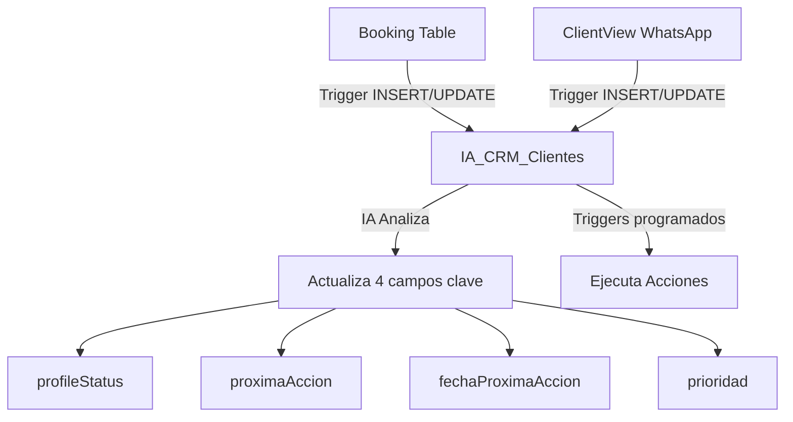

# 📚 Guía Completa: IA_CRM_Clientes

*Última actualización: 29 de Agosto 2025*

## 🎯 Propósito y Visión

### ¿Qué es IA_CRM_Clientes?

Es una tabla **inteligente y dinámica** que unifica TODOS los contactos del negocio (reservas + WhatsApp) para crear un sistema CRM automatizado. Funciona como un "espejo enriquecido" que:

1. **Refleja** datos de `Booking` y `ClientView`
2. **Mantiene** información propia generada por IA
3. **Automatiza** seguimiento y acciones comerciales
4. **Unifica** por número de teléfono (un cliente = un registro)

### Objetivo Principal

> **Convertir datos dispersos en acciones comerciales inteligentes**

- Gestionar el ciclo completo del cliente: desde prospecto hasta post-estancia
- Automatizar seguimientos según el estado de cada cliente
- Maximizar conversiones y reactivaciones mediante IA
- Mantener un registro único por cliente sin duplicados

## 📊 Estructura de la Tabla

### Campos y Su Propósito

| Campo | Tipo | Origen | Descripción |
|-------|------|--------|-------------|
| **id** | SERIAL | Auto | Identificador único |
| **phoneNumber** | VARCHAR(50) | Booking/WhatsApp | 🔑 Clave única de unificación |
| **clientName** | VARCHAR(255) | Booking/WhatsApp | Nombre del cliente |
| **email** | VARCHAR(255) | Booking | Email de contacto |
| **bookingId** | VARCHAR(255) | Booking | Reserva actual (si tiene) |
| **currentStatus** | VARCHAR(50) | Booking | BDStatus exacto o "Contacto WSP" |
| **source** | VARCHAR(50) | Booking/WhatsApp | Origen (booking/airbnb/whatsapp/direct) |
| **profileStatus** | TEXT | **IA** | 🤖 Resumen del perfil del cliente |
| **proximaAccion** | VARCHAR(255) | **IA** | 🤖 Siguiente acción a realizar |
| **fechaProximaAccion** | TIMESTAMP | **IA** | 🤖 Cuándo ejecutar la acción |
| **prioridad** | INTEGER (1-5) | **IA** | 🤖 Urgencia de atención |
| **propertyName** | VARCHAR(255) | Booking | Propiedad reservada |
| **arrivalDate** | DATE | Booking | Fecha de llegada (solo fecha) |
| **departureDate** | DATE | Booking | Fecha de salida (solo fecha) |
| **lastInteraction** | TIMESTAMP | Auto | Última interacción |
| **threadId** | VARCHAR(255) | WhatsApp | ID de conversación |
| **wspLabels** | TEXT | WhatsApp | Etiquetas de WhatsApp |
| **totalBookings** | INTEGER | Calculado | Total histórico de reservas |
| **totalValue** | INTEGER | Calculado | Valor total gastado (sin decimales) |
| **automationEnabled** | BOOLEAN | Manual | Permite automatización |
| **internalNotes** | TEXT | Manual | Notas internas del equipo |
| **createdAt** | TIMESTAMP | Auto | Fecha de creación (YYYY-MM-DD HH:MM:SS) |
| **updatedAt** | TIMESTAMP | Auto | Última actualización (YYYY-MM-DD HH:MM:SS) |

### Estados Posibles (currentStatus)

| Estado | Descripción | Origen |
|--------|-------------|--------|
| **Futura Pendiente** | Reserva pendiente de pago | Directo de Booking.BDStatus |
| **Futura Confirmada** | Reserva pagada, esperando llegada | Directo de Booking.BDStatus |
| **Pasada Confirmada** | Estancia finalizada | Directo de Booking.BDStatus |
| **Cancelada Futura** | Reserva futura cancelada | Directo de Booking.BDStatus |
| **Cancelada Pasada** | Reserva pasada cancelada | Directo de Booking.BDStatus |
| **Contacto WSP** | Contacto solo por WhatsApp | ClientView sin reserva |

## 🔄 Flujo de Sincronización

### Diagrama de Flujo



### Sincronización Automática

#### Desde Booking → CRM

**Trigger:** `trg_booking_to_crm` (INSERT)  
**Trigger:** `trg_booking_update_crm` (UPDATE)  
**Función:** `sync_booking_to_crm()`

**Qué sincroniza:**
- Datos básicos (nombre, teléfono, email)
- Estado calculado según BDStatus
- Métricas (total reservas, valor histórico)
- Fechas y propiedad

**Cuándo se ejecuta:**
- Nueva reserva creada
- Cambio en BDStatus
- Actualización de datos importantes

#### Desde ClientView → CRM

**Trigger:** `trg_whatsapp_to_crm`  
**Función:** `sync_whatsapp_to_crm()`

**Qué sincroniza:**
- Datos del contacto WhatsApp
- Thread ID para seguimiento
- Estado como 'prospecto'

**Condición importante:**
- Solo crea/actualiza si NO tiene reserva activa
- Evita duplicados con clientes existentes

### Lógica Anti-Duplicados

```sql
SI phoneNumber existe en Booking con reserva NO cancelada
  → Usa datos de Booking (cliente activo)
  → NO crea desde WhatsApp
  
SI phoneNumber existe pero SOLO con reservas canceladas
  → Permite crear nuevo registro
  → Oportunidad de reactivación
  
SI phoneNumber solo en WhatsApp
  → Crea como prospecto
```

## 🤖 Integración con IA

### Los 4 Campos Clave de IA

#### 1. profileStatus (TEXT)
**Propósito:** Resumen inteligente del cliente  
**Ejemplo:** *"Familia de 4 personas, viaja frecuentemente en diciembre, busca opciones económicas, habla español, preferencia por check-in temprano"*

**La IA analiza:**
- Historial de conversaciones
- Patrones de reserva
- Preferencias expresadas
- Comportamiento

#### 2. proximaAccion (VARCHAR 255)
**Propósito:** Acción específica a realizar  
**Ejemplos por estado:**

| Estado | Ejemplo de Acción |
|--------|-------------------|
| lead | "Enviar recordatorio de pago del anticipo" |
| confirmado | "Enviar información de check-in 3 días antes" |
| hospedado | "Ofrecer servicios adicionales y actividades" |
| completado | "Solicitar reseña y ofrecer descuento próxima reserva" |
| cancelado | "Enviar oferta especial de reactivación 20% dto" |
| prospecto | "Enviar disponibilidad y tarifas para las fechas consultadas" |

#### 3. fechaProximaAccion (TIMESTAMP)
**Propósito:** Cuándo ejecutar la acción  
**Cálculo inteligente:**
- Para leads: +24 horas
- Para confirmados: arrivalDate - 3 días
- Para hospedados: HOY 14:00
- Para completados: departureDate + 2 días
- Para cancelados: +30 días
- Para prospectos: +6 horas

#### 4. prioridad (INTEGER 1-5)
**Propósito:** Ordenar atención  
**Escala:**
- 1 = Urgente (acción hoy)
- 2 = Alta (próximas 48h)
- 3 = Media (esta semana)
- 4 = Baja (este mes)
- 5 = Muy baja (seguimiento futuro)

**Factores que la IA considera:**
- Proximidad de fecha de llegada
- Valor de la reserva
- Historial del cliente
- Sentiment del último mensaje
- Probabilidad de conversión

### Proceso de Actualización IA

```python
# Pseudocódigo del proceso IA
def analizar_cliente(phone_number):
    # 1. Obtener datos del CRM
    cliente = get_crm_record(phone_number)
    
    # 2. Obtener historial de conversaciones
    chats = get_whatsapp_history(phone_number)
    
    # 3. Analizar con IA
    analysis = ai_analyze({
        'profile': cliente,
        'conversations': chats,
        'booking_history': cliente.totalBookings,
        'current_status': cliente.currentStatus
    })
    
    # 4. Actualizar campos IA
    update_crm({
        'phoneNumber': phone_number,
        'profileStatus': analysis.summary,
        'proximaAccion': analysis.next_action,
        'fechaProximaAccion': analysis.action_date,
        'prioridad': analysis.priority
    })
```

## 📈 Casos de Uso Prácticos

### Caso 1: Lead Nuevo (Reserva sin Pagar)

```
1. Cliente hace reserva en Booking.com
2. Trigger crea registro en CRM con status='lead'
3. IA analiza y establece:
   - profileStatus: "Primera vez, familia 3 personas"
   - proximaAccion: "Enviar enlace de pago y beneficios"
   - fechaProximaAccion: +24 horas
   - prioridad: 1 (urgente)
4. Sistema envía recordatorio automático
5. Cliente paga → status cambia a 'confirmado'
```

### Caso 2: Cliente Recurrente

```
1. Cliente con 3 reservas anteriores hace nueva reserva
2. CRM detecta por phoneNumber
3. IA actualiza:
   - profileStatus: "Cliente VIP, 4ta reserva, preferencia vista mar"
   - proximaAccion: "Upgrade gratuito y welcome gift"
   - prioridad: 1
4. Se aplican beneficios automáticamente
```

### Caso 3: Reactivación de Cancelado

```
1. Cliente canceló hace 30 días
2. IA programa reactivación:
   - proximaAccion: "Oferta 25% descuento, mencionar nueva piscina"
   - fechaProximaAccion: +30 días desde cancelación
3. Se envía oferta personalizada
4. Cliente reserva → ciclo reinicia
```

### Caso 4: Prospecto WhatsApp

```
1. Persona pregunta por WhatsApp sin tener reserva
2. Se crea como 'prospecto' en CRM
3. IA analiza conversación:
   - profileStatus: "Interesado en Semana Santa, presupuesto medio"
   - proximaAccion: "Enviar opciones con early bird 15%"
   - prioridad: 2
4. Seguimiento hasta conversión
```

## 🛠️ Operaciones y Mantenimiento

### Consultas Útiles

#### Ver todos los leads pendientes
```sql
SELECT 
    "clientName",
    "phoneNumber",
    "propertyName",
    "arrivalDate",
    "proximaAccion",
    "prioridad"
FROM "IA_CRM_Clientes"
WHERE "currentStatus" = 'lead'
ORDER BY "prioridad", "arrivalDate";
```

#### Acciones programadas para hoy
```sql
SELECT 
    "clientName",
    "currentStatus",
    "proximaAccion",
    TO_CHAR("fechaProximaAccion", 'HH24:MI') as hora
FROM "IA_CRM_Clientes"
WHERE DATE("fechaProximaAccion") = CURRENT_DATE
ORDER BY "fechaProximaAccion";
```

#### Clientes VIP (más de 3 reservas)
```sql
SELECT 
    "clientName",
    "phoneNumber",
    "totalBookings",
    "totalValue"
FROM "IA_CRM_Clientes"
WHERE "totalBookings" >= 3
ORDER BY "totalValue" DESC;
```

#### Oportunidades de reactivación
```sql
SELECT 
    "clientName",
    "phoneNumber",
    "profileStatus",
    "updatedAt"
FROM "IA_CRM_Clientes"
WHERE "currentStatus" = 'cancelado'
AND "updatedAt" < NOW() - INTERVAL '30 days';
```

### Triggers de Base de Datos

| Trigger | Tabla | Evento | Función |
|---------|-------|--------|---------|
| trg_booking_to_crm | Booking | INSERT | sync_booking_to_crm() |
| trg_booking_update_crm | Booking | UPDATE | sync_booking_to_crm() |
| trg_booking_delete_crm | Booking | DELETE | delete_from_crm() |
| trg_whatsapp_to_crm | ClientView | INSERT/UPDATE | sync_whatsapp_to_crm() |

### Scripts de Mantenimiento

| Script | Propósito | Frecuencia |
|--------|-----------|------------|
| create-ia-crm-simple.js | Crear tabla inicial | Una vez |
| create-crm-triggers.js | Configurar triggers | Una vez |
| sync-ia-crm.js | Re-sincronizar manual | Según necesidad |
| cleanup-old-tables.js | Limpiar backups | Mensual |

## 📊 Métricas y KPIs

### Métricas Automáticas

1. **totalBookings**: Número total de reservas del cliente
2. **totalValue**: Valor acumulado histórico
3. **Tasa de conversión**: Prospectos → Reservas
4. **Tiempo promedio de conversión**: Lead → Confirmado

### KPIs Sugeridos

| KPI | Fórmula | Meta |
|-----|---------|------|
| Conversión de Leads | (Confirmados / Leads) × 100 | > 60% |
| Reactivación | (Cancelados reactivados / Total cancelados) × 100 | > 20% |
| Valor por Cliente | totalValue / totalBookings | Incrementar 10% |
| Respuesta a Acciones | Acciones completadas / Acciones programadas | > 80% |

## 🚀 Roadmap y Mejoras Futuras

### Fase 1 (Actual) ✅
- Tabla creada y sincronizada
- Triggers automáticos funcionando
- Campos IA preparados

### Fase 2 (Próxima)
- Integración con API de IA (GPT/Claude)
- Análisis automático de conversaciones
- Actualización periódica de campos IA

### Fase 3 (Futura)
- Dashboard visual (Retool/Metabase)
- Automatización de envío de mensajes
- Scoring predictivo de conversión
- Segmentación automática

### Fase 4 (Avanzada)
- Machine Learning para predicciones
- Personalización dinámica de ofertas
- A/B testing automático
- Revenue management integrado

## 🔐 Consideraciones de Seguridad

1. **Datos Sensibles**: phoneNumber y email están protegidos
2. **GDPR**: Incluir campo para consentimiento
3. **Backups**: Realizar respaldos diarios
4. **Auditoría**: Log de cambios en campos críticos
5. **Acceso**: Restringir modificación de campos IA

## 📝 Notas Importantes

### Lo que SÍ hace la tabla

✅ Unifica todos los contactos en un solo lugar  
✅ Se actualiza automáticamente con cambios en Booking/WhatsApp  
✅ Preserva campos IA sin sobrescribir  
✅ Evita duplicados inteligentemente  
✅ Calcula métricas automáticamente  

### Lo que NO hace la tabla

❌ No envía mensajes (requiere integración adicional)  
❌ No ejecuta acciones (requiere worker/cron)  
❌ No analiza conversaciones (requiere IA externa)  
❌ No genera reportes (requiere dashboard)  

## 📊 Estadísticas Actuales

### Datos en Producción (29 Agosto 2025)
- **Total registros:** 795
- **Teléfonos únicos:** 795
- **Sincronizado con Booking:** 792/792 (100%)
- **Contactos WhatsApp:** 3

### Distribución por Estado
| Estado | Cantidad | Porcentaje |
|--------|----------|------------|
| Cancelada Pasada | 348 | 43.77% |
| Pasada Confirmada | 342 | 43.02% |
| Futura Confirmada | 51 | 6.42% |
| Sin estado | 27 | 3.40% |
| Futura Pendiente | 18 | 2.26% |
| Contacto WSP | 3 | 0.38% |

## 🆘 Troubleshooting

### Problema: Teléfonos faltantes en CRM
**Solución:**
```javascript
// Sincronización masiva de teléfonos faltantes
// Ejecutar: node scripts/sync-all-missing-bulk.js
```

### Problema: Duplicados en CRM
**Nota:** Por diseño, no deberían existir duplicados ya que `phoneNumber` es UNIQUE.
```sql
-- Verificar integridad
SELECT "phoneNumber", COUNT(*) 
FROM "IA_CRM_Clientes" 
GROUP BY "phoneNumber" 
HAVING COUNT(*) > 1;
```

### Problema: Triggers no funcionan
**Verificar:**
```sql
-- Ver triggers activos
SELECT trigger_name, event_manipulation, event_object_table
FROM information_schema.triggers 
WHERE trigger_name LIKE '%crm%';
```

### Problema: Fechas no formateadas
**Solución:**
```sql
-- Usar la vista con fechas formateadas
SELECT * FROM "IA_CRM_Clientes_View"
WHERE "currentStatus" = 'Futura Pendiente';
```

## 🔧 Scripts de Mantenimiento

| Script | Descripción |
|--------|-------------|
| `sync-all-missing-bulk.js` | Sincroniza todos los teléfonos faltantes |
| `create-crm-triggers.js` | Crea/actualiza triggers de sincronización |
| `finalize-crm-structure.js` | Ajusta estructura y columnas |
| `cleanup-old-tables.js` | Elimina tablas antiguas y backups |

## 📚 Referencias

- [Documentación Prisma](https://www.prisma.io/docs)
- [PostgreSQL Triggers](https://www.postgresql.org/docs/current/sql-createtrigger.html)
- [Best Practices CRM](https://www.salesforce.com/crm/best-practices/)

---

**Última actualización:** 29 de Agosto 2025  
**Versión:** 2.0  
**Autor:** Sistema de Gestión CRM
**Estado:** ✅ Producción - 100% Sincronizado  
**Estado:** ✅ En Producción