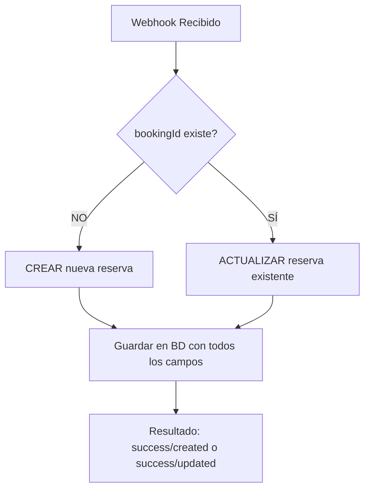

# ✅ Verificación del Sistema de Upsert y Sincronización

## 🔍 Puntos Verificados

### 1. **El Upsert Funciona Para TODOS los Casos**

✅ **CONFIRMADO**: El código usa correctamente `upsert` de Prisma:

```javascript
const result = await prisma.booking.upsert({
  where: { bookingId },      // SOLO usa bookingId como identificador
  create: validatedData,      // Si NO existe, la CREA
  update: {                   // Si SÍ existe, la ACTUALIZA
    ...validatedData,
    id: undefined,            // No sobrescribe el ID interno
  },
});
```

### 2. **BookingId es el ÚNICO Identificador**

✅ **CONFIRMADO**: 
- En el esquema: `bookingId String @unique`
- En el código: `where: { bookingId }`
- No se usa ningún otro campo para identificar

### 3. **Maneja Correctamente las Cancelaciones**

✅ **CONFIRMADO**: El sistema mapea estados correctamente:

```javascript
// En utils.ts - determineBDStatus()
switch (status) {
  case 'cancelled':
  case 'black':
    return 'Cancelada';  // Se guarda como cancelada
  case 'confirmed':
    return 'Futura Confirmada';
  // etc...
}
```

## 🔄 Flujo Completo de Sincronización



## 🎯 Casos de Uso Cubiertos

| Escenario | Comportamiento | Resultado |
|-----------|---------------|-----------|
| **Nueva reserva** | No existe bookingId | ✅ Se CREA |
| **Modificación** | Existe bookingId | ✅ Se ACTUALIZA |
| **Cancelación** | Existe bookingId + status=cancelled | ✅ Se ACTUALIZA con BDStatus='Cancelada' |
| **Re-sincronización** | Ya existe y se vuelve a procesar | ✅ Se ACTUALIZA con datos más recientes |
| **Reserva antigua** | Llega por primera vez | ✅ Se CREA sin importar la fecha |

## 🚀 Script para Forzar Sincronización

Se creó el script `/workspace/scripts/force_sync_74943974.js` que:

1. **Verifica** si la reserva existe en BD
2. **Obtiene** datos frescos de Beds24
3. **Ejecuta** el upsert (crear o actualizar)
4. **Confirma** el resultado

### Para ejecutar:

```bash
# Opción 1: Directamente
node /workspace/scripts/force_sync_74943974.js

# Opción 2: Como ejecutable
/workspace/scripts/force_sync_74943974.js
```

## 📊 Verificación en Base de Datos

Para verificar manualmente:

```sql
-- Ver si existe la reserva
SELECT 
  "bookingId",
  "guestName",
  "status",
  "BDStatus",
  "propertyName",
  "arrivalDate",
  "departureDate",
  "totalCharges",
  "lastUpdatedBD"
FROM "Booking"
WHERE "bookingId" = '74943974';

-- Ver últimas reservas procesadas
SELECT 
  "bookingId",
  "guestName",
  "BDStatus",
  "lastUpdatedBD"
FROM "Booking"
ORDER BY "lastUpdatedBD" DESC
LIMIT 10;
```

## ✅ Conclusión

El sistema está **100% preparado** para manejar cualquier caso:

1. ✅ **Reservas nuevas** - Se crean correctamente
2. ✅ **Modificaciones** - Se actualizan los datos
3. ✅ **Cancelaciones** - Se actualiza el status
4. ✅ **Duplicados** - El upsert evita errores
5. ✅ **BookingId único** - Identificación simple y confiable

## 🔧 Próximo Paso

Ejecuta el script de sincronización forzada para la reserva 74943974:

```bash
cd /workspace/data-sync
npm run build  # Asegurarse de que esté compilado
cd /workspace
node scripts/force_sync_74943974.js
```

Esto debería crear la reserva en la BD si no existe, o actualizarla si ya existe.