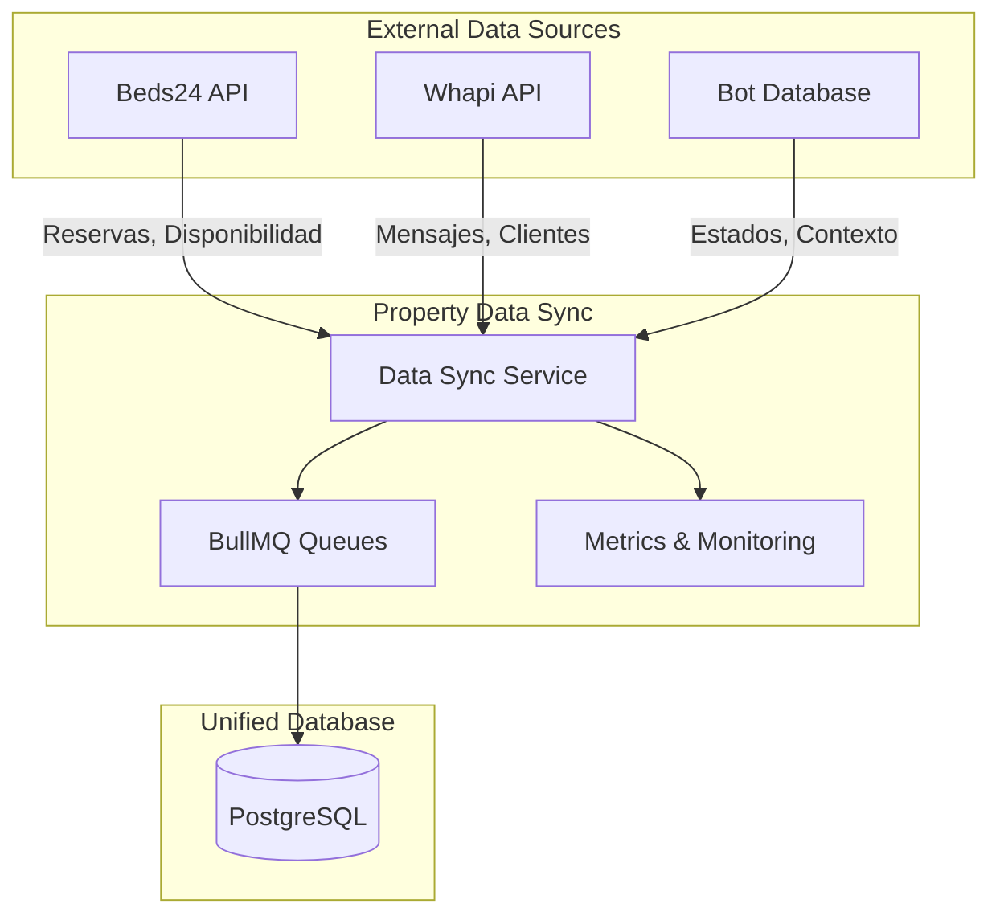

# 🎯 VISIÓN Y ARQUITECTURA - PROPERTY DATA SYNC

## 🌟 **VISIÓN DEL PROYECTO**

**Property Data Sync** es un servicio de integración de datos multi-fuente diseñado para **orquestar el flujo de información** entre múltiples sistemas de gestión hotelera y el ecosistema TeAlquilamos.

### **NO ES:**
- ❌ Un "Beds24 sync service" específico
- ❌ Un simple ETL de una sola fuente
- ❌ Una base de datos administrativa

### **ES:**
- ✅ **Hub de integración** para múltiples fuentes de datos
- ✅ **Orquestador de sincronización** bidireccional
- ✅ **Procesador de eventos** en tiempo real (webhooks)
- ✅ **Centro de observabilidad** para flujos de datos

## 🏗️ **ARQUITECTURA MULTI-FUENTE**

### **FUENTES DE DATOS ACTUALES:**


### **FUENTES FUTURAS PLANIFICADAS:**
- **Airbnb API**: Listings y reservas
- **Booking.com Connectivity**: Channel management
- **Stripe API**: Pagos y billing
- **Google Calendar**: Sincronización de disponibilidad
- **PMS Locales**: Otros sistemas hoteleros

## 📊 **TIPOS DE DATOS MANEJADOS**

### **1. Reservas y Bookings**
```typescript
interface UnifiedReservation {
  source: 'beds24' | 'airbnb' | 'booking' | 'direct';
  externalId: string;
  guestInfo: GuestInfo;
  propertyInfo: PropertyInfo;
  dates: DateRange;
  pricing: PricingInfo;
  status: ReservationStatus;
}
```

### **2. Leads y Prospectos**
```typescript
interface UnifiedLead {
  source: 'whapi' | 'web' | 'phone' | 'referral';
  contactInfo: ContactInfo;
  interests: PropertyInterests;
  conversationContext: Context;
  priority: 'alta' | 'media' | 'baja';
}
```

### **3. Disponibilidad de Propiedades**
```typescript
interface PropertyAvailability {
  propertyId: string;
  dateRange: DateRange;
  status: 'available' | 'booked' | 'blocked';
  pricing: DynamicPricing;
  restrictions: BookingRestrictions;
}
```

## 🔄 **PATRONES DE INTEGRACIÓN**

### **1. Webhook Processing**
```
External System → Webhook → Queue → Processing → Database → Metrics
```

### **2. Scheduled Sync**
```
Cron Schedule → Bulk Fetch → Transform → Upsert → Validation → Metrics
```

### **3. Real-time Events**
```
Database Trigger → Event → Queue → External API → Response → Update
```

### **4. Bidirectional Sync**
```
Source A ⟷ Unified DB ⟷ Source B
```

## 🎯 **CASOS DE USO PRINCIPALES**

### **1. Sincronización de Reservas**
- Beds24 → DB: Nuevas reservas, modificaciones, cancelaciones
- DB → Whapi: Notificaciones a guests
- DB → Bot: Contexto para conversaciones

### **2. Gestión de Leads**
- Whapi → DB: Nuevos prospectos desde WhatsApp
- Web → DB: Formularios de contacto
- DB → CRM: Seguimiento automatizado

### **3. Actualización de Disponibilidad**
- Beds24 → DB: Calendarios actualizados
- DB → Airbnb: Sincronización de disponibilidad
- DB → Web: Mostrar disponibilidad real

### **4. Reporting y Analytics**
- Múltiples fuentes → DB: Data consolidada
- DB → Metrics: KPIs de negocio
- Metrics → Dashboards: Visualización

## 🚀 **ESCALABILIDAD Y FUTURO**

### **Diseño para Crecimiento**
- **Provider Pattern**: Fácil adición de nuevas fuentes
- **Queue System**: Manejo de alta concurrencia
- **Event-Driven**: Arquitectura reactiva
- **Microservices Ready**: Componentes desacoplados

### **Evolución Prevista**
1. **Fase Actual**: Beds24 + Whapi
2. **Fase 2**: Airbnb + Booking.com
3. **Fase 3**: Pagos + Analytics avanzado
4. **Fase 4**: ML/AI para pricing y demand forecasting

## 📈 **BENEFICIOS DEL ENFOQUE MULTI-FUENTE**

### **Para el Negocio**
- **Visión 360°**: Datos consolidados de todas las fuentes
- **Automatización**: Menos trabajo manual
- **Decisiones Data-Driven**: Métricas unificadas

### **Para Desarrollo**
- **Reutilización**: Infraestructura común para nuevas integraciones
- **Mantenibilidad**: Un solo lugar para lógica de sync
- **Observabilidad**: Monitoring centralizado

### **Para Operaciones**
- **Confiabilidad**: Retry automático y error handling
- **Escalabilidad**: Queues para manejar picos de carga
- **Monitoring**: Alertas proactivas

## 🔮 **ROADMAP TÉCNICO**

### **Q1 2025: Consolidación**
- ✅ Beds24 integration sólida
- 🔄 Whapi integration mejorada
- ✅ Monitoring y métricas

### **Q2 2025: Expansión**
- 🆕 Airbnb API integration
- 🆕 Generic webhook handler
- 🆕 Data transformation engine

### **Q3 2025: Optimización**
- 🆕 ML-powered data validation
- 🆕 Predictive sync scheduling
- 🆕 Advanced analytics

### **Q4 2025: Ecosystem**
- 🆕 Public API para partners
- 🆕 Real-time data streaming
- 🆕 Multi-tenant architecture

---

**Property Data Sync no es solo un sincronizador - es el sistema nervioso central del ecosistema de datos de TeAlquilamos.** 🧠