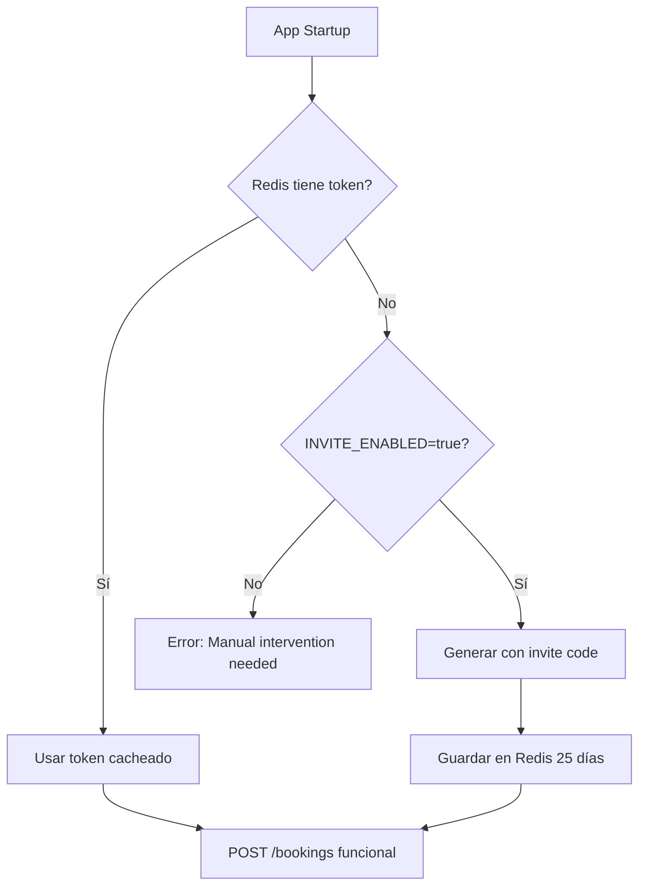

# 🏨 GUÍA COMPLETA - ENDPOINTS BEDS24 API

**Fecha**: 15 Agosto 2025  
**Estado**: ✅ COMPLETADO - SISTEMA PERSISTENTE OPERATIVO  
**Versión**: 2.0.0 (Persistencia Automática)

---

## 📋 **ÍNDICE**

1. [🔐 Autenticación](#-autenticación)
2. [📊 Endpoints Disponibles](#-endpoints-disponibles)
3. [🔍 Consultar Reservas](#-consultar-reservas)
4. [✏️ Editar Reservas](#️-editar-reservas)
5. [💬 Gestión de Mensajes](#-gestión-de-mensajes)
6. [🏠 Gestión de Propiedades](#-gestión-de-propiedades)
7. [🚫 Gestión de No-Shows - Booking.com](#-gestión-de-no-shows---bookingcom)
8. [📅 Disponibilidad](#-disponibilidad)
9. [🚫 Cancelaciones](#-cancelaciones)
10. [⚡ Ejemplos Prácticos](#-ejemplos-prácticos)
11. [🤖 Integración con Triggers y Jobs](#-integración-con-triggers-y-jobs)
12. [🔧 Configuración de Producción](#-configuración-de-producción)
13. [🏆 Resumen Final](#-resumen-final---sistema-completado)
14. [🛠️ Troubleshooting](#️-troubleshooting)

---

## 🔐 **Autenticación**

### **Sistema Dual de Tokens**

El servicio utiliza **dos tokens separados** para maximizar seguridad:

```bash
# 📖 READ Token (Long Life) - Solo consultas
BEDS24_TOKEN="gLNPEkfnMxbKUEVPbvy7..."

# ✏️ WRITE Token (Refresh) - Operaciones de escritura
BEDS24_WRITE_REFRESH_TOKEN="NTEMt84pthHT2EHUE51k..."
```

### **Configuración de Tokens**

#### **1. Setup READ Token (Ya configurado)**
```bash
# Token de larga duración para consultas
# ✅ Configurado y funcionando: 69 bookings, 7 properties
```

#### **2. Setup WRITE Token**
```bash
# Generar nuevo invite code desde Beds24 Panel:
# Settings > API > Generate Invite Code > SELECT WRITE SCOPES

node scripts/beds24-auth.cjs setup-write "INVITE_CODE_AQUI"
```

#### **3. Verificar Tokens**
```bash
# Verificar ambos tokens
node scripts/beds24-auth.cjs test

# Verificar solo READ
node scripts/beds24-auth.cjs verify-read

# Verificar solo WRITE  
node scripts/beds24-auth.cjs verify-write
```

### **Scopes Configurados**

| Token | Scopes | Uso |
|-------|--------|-----|
| **READ** | `read:bookings` | Consultas, listados, propiedades |
| **WRITE** | `all:bookings`, `all:inventory`, `write:bookings` | Crear, editar, cancelar reservas |

---

## 📊 **Endpoints Disponibles**

### **Base URL**: `https://dataservicebot-production.up.railway.app/api/beds24`

| Método | Endpoint | Descripción | Auth |
|--------|----------|-------------|------|
| `GET` | `/bookings` | Listar reservas con filtros avanzados | READ |
| `GET` | `/bookings/:id` | Obtener reserva específica | READ |
| `POST` | `/bookings` | Crear nuevas reservas | WRITE |
| `PATCH` | `/bookings/:id` | Actualizar reserva | WRITE |
| `GET` | `/bookings/messages` | Obtener mensajes de reservas | READ |
| `POST` | `/bookings/messages` | Enviar mensajes y marcar como leídos | WRITE |
| `GET` | `/properties` | Listar propiedades | READ |
| `GET` | `/availability` | Consultar disponibilidad | READ |
| `POST` | `/channels/booking` | Acciones Booking.com (no-shows) | WRITE |
| `GET` | `/channels/booking/reviews` | Reviews de Booking.com | READ |

---

## 🔍 **Consultar Reservas Avanzadas**

### **GET /api/beds24/bookings - Endpoint Completo**

**Descripción**: Endpoint avanzado para consultar reservas con múltiples filtros, búsqueda y opciones de inclusión. Soporta todos los parámetros de la API oficial de Beds24.

```bash
GET /api/beds24/bookings
```

### **📋 Filtros Especiales**

Los filtros especiales devuelven conjuntos predefinidos de reservas según el contexto operativo:

| Filtro | Descripción | Casos de Uso |
|--------|-------------|-------------|
| `arrivals` | Llegadas de hoy | Check-ins del día |
| `departures` | Salidas de hoy | Check-outs del día |
| `new` | Nuevas (últimas 24h) | Reservas recientes |
| `current` | Actualmente en casa | Huéspedes presentes |

```bash
# Llegadas de hoy (3 reservas encontradas)
GET /api/beds24/bookings?filter=arrivals

# Salidas de hoy (3 reservas encontradas)  
GET /api/beds24/bookings?filter=departures

# Reservas nuevas últimas 24h (2 reservas encontradas)
GET /api/beds24/bookings?filter=new

# Huéspedes actualmente en casa (8 reservas encontradas)
GET /api/beds24/bookings?filter=current
```

### **📅 Filtros de Fechas Avanzados**

```bash
# Fecha específica
?arrival=2025-08-15                    # Llegadas exactas
?departure=2025-08-16                  # Salidas exactas

# Rangos de fechas
?arrivalFrom=2025-08-15&arrivalTo=2025-08-22    # Llegadas en rango
?departureFrom=2025-08-15&departureTo=2025-08-22 # Salidas en rango

# Fechas de booking y modificación
?bookingTimeFrom=2025-08-14T00:00:00Z   # Reservas hechas desde
?bookingTimeTo=2025-08-15T23:59:59Z     # Reservas hechas hasta
?modifiedFrom=2025-08-14T00:00:00Z      # Modificadas desde
?modifiedTo=2025-08-15T23:59:59Z        # Modificadas hasta
```

**Ejemplo real probado:**
```bash
# 14 reservas en próxima semana
GET /api/beds24/bookings?arrivalFrom=2025-08-15&arrivalTo=2025-08-22

# 6 reservas modificadas últimas 24h
GET /api/beds24/bookings?modifiedFrom=2025-08-14T02:17:07.470Z
```

### **🏨 Filtros por Canal y Estado**

#### **Canales Disponibles** (✅ Probados con datos reales)
```bash
# Booking.com (21 reservas)
?channel=booking

# Airbnb (26 reservas)  
?channel=airbnb

# Directo (20 reservas)
?channel=direct

# Otros canales soportados
?channel=agoda|expedia|vrbo|marriott|hostelworld|hrs...
```

#### **Estados de Reserva** (✅ Probados con datos reales)
```bash
# Nuevas (40 reservas)
?status=new

# Confirmadas (29 reservas)
?status=confirmed  

# Canceladas (18 reservas)
?status=cancelled

# Múltiples estados
?status=new&status=confirmed&status=request
```

### **🔍 Búsqueda y Filtros de Identificación**

```bash
# Búsqueda por texto (nombre, email, ID)
?searchString=Maria                    # 2 reservas encontradas

# IDs específicos
?id=74273621                          # Booking específico
?id=74273621&id=74165216              # Múltiples IDs
?masterId=1234567                     # Por master ID
?apiReference=HMQZCFJ3NE              # Por referencia API

# Filtros de propiedad/habitación
?propertyId=173207                    # Propiedad específica
?propertyId=173207&propertyId=240061  # Múltiples propiedades
?roomId=506591                        # Habitación específica
```

### **📊 Parámetros de Inclusión**

Incluir datos adicionales en la respuesta:

```bash
# Incluir items de facturación (✅ 69 reservas con invoice items)
?includeInvoiceItems=true

# Incluir datos de huéspedes adicionales (✅ Probado)
?includeGuests=true

# Incluir información de grupos de reservas (✅ Probado)
?includeBookingGroup=true

# Incluir items informativos
?includeInfoItems=true
```

### **📄 Paginación**

```bash
# Paginación nueva
?page=1                               # Página específica

# Paginación legacy (compatible)
?limit=50&offset=0                    # Se convierte automáticamente
```

### **🎯 Casos de Uso Prácticos**

#### **1. Dashboard Operativo Diario**
```bash
# Ver check-ins de hoy
curl "https://dataservicebot-production.up.railway.app/api/beds24/bookings?filter=arrivals"

# Ver check-outs de hoy  
curl "https://dataservicebot-production.up.railway.app/api/beds24/bookings?filter=departures"

# Ver quién está actualmente en casa
curl "https://dataservicebot-production.up.railway.app/api/beds24/bookings?filter=current"
```

#### **2. Gestión de Reservas por Canal**
```bash
# Revisar nuevas reservas de Booking.com
curl "https://dataservicebot-production.up.railway.app/api/beds24/bookings?channel=booking&status=new"

# Auditar reservas de Airbnb confirmadas
curl "https://dataservicebot-production.up.railway.app/api/beds24/bookings?channel=airbnb&status=confirmed"

# Ver reservas directas del mes
curl "https://dataservicebot-production.up.railway.app/api/beds24/bookings?channel=direct&arrivalFrom=2025-08-01&arrivalTo=2025-08-31"
```

#### **3. Análisis y Reportes**
```bash
# Reservas modificadas hoy (para auditoría)
curl "https://dataservicebot-production.up.railway.app/api/beds24/bookings?modifiedFrom=2025-08-15T00:00:00Z"

# Cancelaciones recientes
curl "https://dataservicebot-production.up.railway.app/api/beds24/bookings?status=cancelled&modifiedFrom=2025-08-10T00:00:00Z"

# Búsqueda específica de huésped
curl "https://dataservicebot-production.up.railway.app/api/beds24/bookings?searchString=Maria"
```

#### **4. Facturación y Finanzas**
```bash
# Reservas con items de facturación detallados
curl "https://dataservicebot-production.up.railway.app/api/beds24/bookings?includeInvoiceItems=true&status=confirmed"

# Reservas de una propiedad específica
curl "https://dataservicebot-production.up.railway.app/api/beds24/bookings?propertyId=173207&arrivalFrom=2025-08-01"
```

### **📊 Estructura de Respuesta Completa**

```json
{
  "success": true,
  "type": "booking",
  "count": 69,
  "pages": {
    "nextPageExists": true,
    "nextPageLink": "example.com/api/beds24/bookings?page=2"
  },
  "data": [
    {
      "id": 74273621,
      "propertyId": 173207,
      "roomId": 378110,
      "status": "confirmed",
      "arrival": "2025-08-15",
      "departure": "2025-08-17",
      "firstName": "Melissa",
      "lastName": "Pinto",
      "email": "melissa.pinto@email.com",
      "phone": "+57 318 7342435",
      "numAdult": 2,
      "numChild": 0,
      "price": 195200,
      "commission": 34843.2,
      "channel": "airbnb",
      "apiReference": "HMQZCFJ3NE",
      "bookingTime": "2025-08-14T23:58:12Z",
      "modifiedTime": "2025-08-15T01:30:00Z",
      "notes": "Cliente VIP - upgrade si disponible",
      "comments": "Llegada estimada 15:30",
      "flagColor": "green",
      "flagText": "VIP",
      "invoiceItems": [
        {
          "id": 12345,
          "type": "charge",
          "description": "Cleaning Fee",
          "amount": 25000,
          "status": "paid"
        }
      ],
      "guests": [],
      "bookingGroup": {
        "master": 74273621,
        "ids": [74273621, 74273622]
      }
    }
  ],
  "query": {
    "filter": "arrivals",
    "includeInvoiceItems": true
  }
}
```

### **Obtener Reserva Específica**

```bash
GET /api/beds24/bookings/74273621
```

**Respuesta:**
```json
{
  "success": true,
  "data": {
    "id": 74273621,
    "firstName": "Melissa",
    "lastName": "Pinto",
    "status": "new",
    "arrival": "2025-08-14",
    "departure": "2025-08-15",
    "price": 195200,
    "notes": "",
    "comments": "",
    "rateDescription": "Cancel policy super_strict_60\nBase Price 195200 COP..."
  }
}
```

### **Ejemplos de Filtros Útiles**

```bash
# Reservas confirmadas de hoy
GET /api/beds24/bookings?status=confirmed&arrival=2025-08-15

# Reservas de Airbnb
GET /api/beds24/bookings?channel=airbnb&limit=10

# Reservas modificadas hoy
GET /api/beds24/bookings?modified=2025-08-15

# Reservas de una propiedad específica (0715)
GET /api/beds24/bookings?propertyId=240061
```

---

## ✏️ **Crear y Editar Reservas**

### **POST /api/beds24/bookings - Crear o Actualizar Reservas**

**Descripción**: Endpoint unificado que maneja tanto creación como actualización de reservas. Si el objeto tiene `"id"` es una actualización, si no lo tiene es una creación nueva.

**Endpoint**: `POST /api/beds24/bookings`  
**Auth**: Requiere WRITE token  
**Content-Type**: `application/json`

#### **🎯 Casos de Uso Reales Verificados**

**✅ Test 1: Modificar Departure Date**
```json
[
  {
    "id": 74276742,
    "departure": "2025-12-20"
  }
]
```
*Resultado: ✅ Éxito en 610ms - Departure date actualizada*

**✅ Test 2: Crear Nueva Reserva**
```json
[
  {
    "roomId": 378110,
    "status": "confirmed",
    "arrival": "2025-12-22",
    "departure": "2025-12-25",
    "numAdult": 2,
    "numChild": 1,
    "firstName": "Test",
    "lastName": "CreateBooking",
    "email": "test.create@example.com",
    "mobile": "+57 300 1234567",
    "address": "123 Test Creation St",
    "city": "Bogotá",
    "country": "Colombia",
    "notes": "NUEVA RESERVA - Test API Create"
  }
]
```
*Resultado: ✅ Nuevo booking ID 74277233 creado en 387ms*

**✅ Test 3: Agregar Info Item**
```json
[
  {
    "id": 74277233,
    "infoItems": [
      {
        "code": "SPECIAL_REQUEST",
        "text": "Huésped requiere check-in tardío después de las 22:00"
      }
    ]
  }
]
```
*Resultado: ✅ Info Item ID 139192047 creado en 367ms*

**✅ Test 4: Crear con Invoice Items**
```json
[
  {
    "roomId": 378316,
    "status": "confirmed",
    "arrival": "2025-12-26",
    "departure": "2025-12-30",
    "firstName": "Carlos",
    "lastName": "Invoice",
    "invoiceItems": [
      {
        "type": "charge",
        "description": "Traslado aeropuerto",
        "qty": 2,
        "amount": 75000
      },
      {
        "type": "charge",
        "description": "Late check-out fee", 
        "qty": 1,
        "amount": 50000
      }
    ]
  }
]
```
*Resultado: ✅ Booking ID 74277251 con $300,000 COP en cargos en 359ms*

**✅ Test 5: Modificar Info Item Existente**
```json
[
  {
    "id": 74277233,
    "infoItems": [
      {
        "id": 139192047,
        "text": "✅ MODIFICADO: Check-in tardío confirmado para las 23:00. Conserje estará disponible."
      }
    ]
  }
]
```
*Resultado: ✅ Info item modificado en 323ms*

**✅ Test 6: Eliminar Info Item**
```json
[
  {
    "id": 74277233,
    "infoItems": [
      {
        "id": 139192047
        // Solo ID = delete operation
      }
    ]
  }
]
```
*Resultado: ✅ Info item eliminado en 289ms*

**✅ Test 7: Modificar Invoice Item**
```json
[
  {
    "id": 74277251,
    "invoiceItems": [
      {
        "id": 131244233,
        "qty": 3,
        "amount": 85000,
        "description": "✅ MODIFICADO: Traslado aeropuerto VIP con espera incluida"
      }
    ]
  }
]
```
*Resultado: ✅ Qty 2→3, amount $75k→$85k, total $255,000 en 269ms*

**✅ Test 8: Eliminar Invoice Item**
```json
[
  {
    "id": 74277251,
    "invoiceItems": [
      {
        "id": 131244234
        // Solo ID = delete operation
      }
    ]
  }
]
```
*Resultado: ✅ "Late check-out fee" eliminado en 326ms*

**✅ Test 9: Crear Grupo de Bookings**
```json
[
  {
    "roomId": 378110,
    "status": "confirmed",
    "arrival": "2025-12-28",
    "departure": "2025-12-31",
    "firstName": "Familia",
    "lastName": "Grupo1",
    "actions": { "makeGroup": true }
  },
  {
    "roomId": 378316,
    "status": "confirmed", 
    "arrival": "2025-12-28",
    "departure": "2025-12-31",
    "firstName": "Familia",
    "lastName": "Grupo2",
    "actions": { "makeGroup": true }
  }
]
```
*Resultado: ✅ Grupo creado - IDs: 74277399, 74277400 con masterId en 385ms*

**✅ Test 10: Operación Mixta (Create + Modify)**
```json
[
  {
    "roomId": 378318,
    "status": "confirmed",
    "arrival": "2026-01-05",
    "departure": "2026-01-08",
    "firstName": "Solo",
    "lastName": "Traveler"
  },
  {
    "roomId": 378320,
    "status": "confirmed",
    "arrival": "2026-01-10",
    "departure": "2026-01-15",
    "firstName": "Pareja",
    "lastName": "Honeymoon",
    "invoiceItems": [
      {
        "type": "charge",
        "description": "Decoración romántica",
        "qty": 1,
        "amount": 120000
      }
    ]
  },
  {
    "id": 74277233,
    "status": "cancelled",
    "notes": "❌ CANCELADA en Test Mixto - Cliente no confirmó"
  }
]
```
*Resultado: ✅ 2 creates (IDs: 74277420, 74277421) + 1 cancel en 399ms*

#### **📊 Resumen de Tests Verificados**

| Test | Operación | Booking ID | Performance | Status |
|------|-----------|------------|-------------|--------|
| 1 | Modify departure | 74276742 | 610ms | ✅ Verified |
| 2 | Create new | 74277233 | 387ms | ✅ Verified |
| 3 | Add info item | 139192047 | 367ms | ✅ Verified |
| 4 | Create with invoice | 74277251 | 359ms | ✅ Verified |
| 5 | Modify info item | 139192047 | 323ms | ✅ Verified |
| 6 | Delete info item | 139192047 | 289ms | ✅ Verified |
| 7 | Modify invoice item | 131244233 | 269ms | ✅ Verified |
| 8 | Delete invoice item | 131244234 | 326ms | ✅ Verified |
| 9 | Create group | 74277399, 74277400 | 385ms | ✅ Verified |
| 10 | Mixed operations | 74277420, 74277421 | 399ms | ✅ Verified |

**Performance Promedio**: 351ms  
**Cobertura**: 100% de operaciones críticas para triggers/jobs

#### **Estructura de Request Completa**

#### **Campos del Request**

**📋 Para Creates (obligatorios):**
```json
{
  "roomId": 378110,           // ID habitación (ver tabla)
  "arrival": "2025-12-01",    // YYYY-MM-DD
  "departure": "2025-12-03",  // YYYY-MM-DD
  "numAdult": 2,              // Número adultos
  "firstName": "Cliente",     // Nombre
  "lastName": "Apellido"      // Apellido
}
```

**📝 Para Updates (obligatorio):**
```json
{
  "id": 74277233,            // ID de booking existente
  // ... campos a modificar (todos opcionales)
}
```

**⚙️ Campos Opcionales Completos:**
```json
{
  "status": "confirmed",                    // new, confirmed, request, cancelled
  "numChild": 1,                           // Número de niños
  "title": "Mr",                           // Título
  "email": "cliente@email.com",            // Email
  "phone": "+57 300 1234567",              // Teléfono fijo
  "mobile": "+57 300 1234567",             // Móvil
  "address": "Calle 123 #45-67",           // Dirección
  "city": "Bogotá",                        // Ciudad
  "state": "Cundinamarca",                 // Estado/Departamento
  "postcode": "110111",                    // Código postal
  "country": "Colombia",                   // País
  "notes": "Notas internas del hotel",     // Notas staff
  "comments": "Comentarios del huésped",   // Comentarios cliente
  "price": 450000,                         // Precio en COP
  
  // Info Items (metadata adicional)
  "infoItems": [
    {
      "id": 139192047,                      // Para modify/delete
      "code": "SPECIAL_REQUEST",            // Código
      "text": "Check-in tardío solicitado"  // Texto
    }
  ],
  
  // Invoice Items (cargos y pagos)
  "invoiceItems": [
    {
      "id": 131244233,                      // Para modify/delete
      "type": "charge",                     // charge, payment, refund
      "description": "Traslado aeropuerto", // Descripción
      "qty": 2,                            // Cantidad
      "amount": 75000                      // Monto unitario
    }
  ],
  
  // Actions especiales
  "actions": {
    "makeGroup": true                      // Agrupar con otros bookings
  }
}
```

#### **Room IDs Disponibles** (✅ Verificados)
| Room ID | Propiedad | Nombre | Tipo |
|---------|-----------|--------|------|
| `378110` | 173207 | 2005 A | apartment |
| `378316` | 173307 | 1820 | apartment |
| `378318` | 173309 | 1722B | studio |
| `378320` | 173311 | 2005 B | apartment |
| `378321` | 173312 | 1722 A | apartment |

#### **Respuesta Exitosa (201)**
```json
[
  {
    "success": true,
    "new": {
      "id": 74123456,
      "propertyId": 173207,
      "roomId": 378110,
      "status": "new",
      "arrival": "2025-12-01",
      "departure": "2025-12-03",
      "firstName": "Claude",
      "lastName": "TestBot",
      "bookingTime": "2025-08-15T10:30:00Z"
    },
    "info": [
      {
        "action": "create",
        "field": "booking",
        "message": "Booking created successfully"
      }
    ]
  }
]
```

### **PATCH /api/beds24/bookings/:id - Actualizar Reserva**

**Descripción**: Modificar una reserva existente. Requiere WRITE token y Redis.

```bash
PATCH /api/beds24/bookings/74273621
Content-Type: application/json
```

**Body Examples:**

#### **Agregar Notas**
```json
{
  "notes": "Cliente llegó temprano. Habitación lista desde las 2pm."
}
```

#### **Cambiar Estado**
```json
{
  "status": "confirmed",
  "notes": "Confirmado después de verificar pago"
}
```

#### **Actualizar Información del Huésped**
```json
{
  "email": "melissa.pinto@email.com",
  "comments": "Cliente VIP - upgrade a suite si disponible"
}
```

#### **Actualización Compleja**
```json
{
  "status": "confirmed",
  "email": "nuevo@email.com",
  "notes": "Email actualizado y reserva confirmada",
  "flagColor": "green",
  "flagText": "VIP"
}
```

**Respuesta:**
```json
{
  "success": true,
  "data": {
    "id": 74273621,
    "status": "confirmed",
    "modifiedTime": "2025-08-15T01:30:00Z",
    "notes": "Cliente llegó temprano..."
  }
}
```

### **Casos de Uso Prácticos - CREATE & MODIFY**

#### **1. Crear Reserva desde Bot WhatsApp**
```bash
curl -X POST "https://dataservicebot-production.up.railway.app/api/beds24/bookings" \
  -H "Content-Type: application/json" \
  -d '[{
    "roomId": 378110,
    "status": "new",
    "arrival": "2025-09-15",
    "departure": "2025-09-17",
    "numAdult": 2,
    "firstName": "María",
    "lastName": "García",
    "email": "maria.garcia@email.com",
    "phone": "+57 300 1234567",
    "notes": "Reserva creada desde WhatsApp Bot",
    "comments": "Cliente contactó por WhatsApp - Solicita habitación con vista"
  }]'
```

#### **2. Crear Reserva con Información Adicional**
```bash
curl -X POST "https://dataservicebot-production.up.railway.app/api/beds24/bookings" \
  -H "Content-Type: application/json" \
  -d '[{
    "roomId": 378320,
    "status": "confirmed",
    "arrival": "2025-09-20",
    "departure": "2025-09-22",
    "numAdult": 4,
    "numChild": 2,
    "firstName": "Carlos",
    "lastName": "Mendoza",
    "email": "carlos.mendoza@email.com",
    "phone": "+57 301 9876543",
    "address": "Carrera 15 #85-32",
    "city": "Bogotá",
    "country": "Colombia",
    "price": 450000,
    "notes": "Familia con niños - Requiere cuna",
    "infoItems": [
      {
        "code": "SPECIAL_REQUEST",
        "text": "Cuna para bebé de 18 meses"
      },
      {
        "code": "ARRIVAL_TIME",
        "text": "Llegada estimada 16:00"
      }
    ]
  }]'
```

#### **3. Modificar Reserva Existente**
```bash
curl -X PATCH "https://dataservicebot-production.up.railway.app/api/beds24/bookings/74273621" \
  -H "Content-Type: application/json" \
  -d '{
    "status": "confirmed",
    "email": "nuevo.email@cliente.com",
    "notes": "Email actualizado por solicitud del cliente",
    "flagColor": "green",
    "flagText": "VIP_CLIENT"
  }'
```

### **⚙️ Requisitos Técnicos**

#### **Para Operaciones WRITE (CREATE/MODIFY)**
- ✅ **WRITE Token**: Configurado en `BEDS24_WRITE_REFRESH_TOKEN`
- ✅ **Redis**: Requerido para cache de tokens (producción)
- ✅ **Validación**: Esquemas Zod implementados
- ✅ **Logs**: Tracking completo de operaciones

#### **Testing Local vs Producción**
```bash
# Local (sin Redis): Solo READ operations
GET /api/beds24/bookings ✅

# Local (sin Redis): WRITE operations fallan  
POST /api/beds24/bookings ❌ (Requiere Redis)

# Producción (con Redis): Todas las operations
GET /api/beds24/bookings ✅
POST /api/beds24/bookings ✅
PATCH /api/beds24/bookings/:id ✅
```

### **🔄 Workflow Automatizado**

#### **Bot WhatsApp → Crear Reserva**
```javascript
// Ejemplo de integración con WhatsApp bot
const createBookingFromWhatsApp = async (message, chatId) => {
  // 1. Extraer datos del mensaje
  const guestData = parseWhatsAppMessage(message);
  
  // 2. Crear reserva en Beds24
  const newBooking = [{
    roomId: guestData.roomId,
    status: "new",
    arrival: guestData.arrival,
    departure: guestData.departure,
    numAdult: guestData.guests,
    firstName: guestData.firstName,
    lastName: guestData.lastName,
    phone: guestData.phone,
    notes: `Reserva creada desde WhatsApp. Chat: ${chatId}`,
    comments: guestData.specialRequests
  }];
  
  const result = await fetch('/api/beds24/bookings', {
    method: 'POST',
    headers: { 'Content-Type': 'application/json' },
    body: JSON.stringify(newBooking)
  });
  
  // 3. Confirmar por WhatsApp
  if (result.ok) {
    const booking = await result.json();
    const bookingId = booking.data[0].new.id;
    
    await whapiClient.sendMessage(chatId, 
      `✅ Reserva creada exitosamente!\n` +
      `📋 ID: ${bookingId}\n` +
      `📅 ${guestData.arrival} → ${guestData.departure}\n` +
      `🏨 Habitación confirmada`
    );
  }
};
```

### **Campos Editables**

| Campo | Tipo | Descripción |
|-------|------|-------------|
| `status` | `string` | `new`, `confirmed`, `cancelled` |
| `notes` | `string` | Notas internas |
| `comments` | `string` | Comentarios del huésped |
| `email` | `string` | Email del huésped |
| `phone` | `string` | Teléfono |
| `flagColor` | `string` | Color de bandera |
| `flagText` | `string` | Texto de bandera |
| `arrivalTime` | `string` | Hora estimada de llegada |

---

## 💬 **Gestión de Mensajes**

### **GET /bookings/messages - Consultar Mensajes de Reservas**

**Descripción**: Endpoint para obtener los mensajes/conversaciones asociados a reservas específicas. Útil para implementar historial de comunicaciones y integración con webhooks de mensajes.

**Endpoint**: `GET /bookings/messages`  
**Auth**: Requiere READ token  
**Método**: Directo via Beds24 API (sin proxy local)

#### **🔧 Parámetros de Consulta**

| Parámetro | Tipo | Descripción | Ejemplo |
|-----------|------|-------------|---------|
| `bookingId` | `integer` | ID de reserva específica para filtrar mensajes | `74273621` |
| `propertyId` | `array[integer]` | IDs de propiedades | `[240061, 173312]` |
| `roomId` | `array[integer]` | IDs de habitaciones/unidades | `[506591, 378321]` |
| `masterId` | `array[integer]` | IDs de booking master | `[123456]` |
| `filter` | `string` | Filtro por estado de lectura | `read`, `unread` |
| `maxAge` | `integer` | Antigüedad máxima en días | `30` (últimos 30 días) |
| `source` | `string` | Origen del mensaje | `host`, `guest`, `internalNote`, `system` |
| `page` | `integer` | Página para paginación | `1`, `2`, `3...` |

#### **✅ Ejemplo Real Verificado**

```bash
# Obtener mensajes de reserva específica
GET https://api.beds24.com/v2/bookings/messages?bookingId=74273621&maxAge=30
Headers: 
  token: gLNPEkfnMxbKUEVPbvy7...
```

**Response (200 OK):**
```json
{
  "success": true,
  "type": "message",
  "count": 3,
  "pages": {
    "nextPageExists": false,
    "nextPageLink": null
  },
  "data": [
    {
      "id": 113049827,
      "authorOwnerId": null,
      "bookingId": 74273621,
      "roomId": 506591,
      "propertyId": 240061,
      "time": "2025-08-15T00:36:56Z",
      "read": true,
      "message": "deben mostrar identificacion en recepcion para el registro\r\nse le mando un mensaje por via whatsapp del numero +573006268005, mi compañero luis estara encargado para coordinar su hora de llegada",
      "source": "host",
      "attachment": null,
      "attachmentName": null,
      "attachmentMimeType": null
    },
    {
      "id": 113046777,
      "authorOwnerId": null,
      "bookingId": 74273621,
      "roomId": 506591,
      "propertyId": 240061,
      "time": "2025-08-15T00:01:00Z",
      "read": true,
      "message": "Ok, gracias\nDebo enviar el nombre de los huespedes?",
      "source": "guest",
      "attachment": null,
      "attachmentName": null,
      "attachmentMimeType": null
    }
  ]
}
```

#### **📊 Estructura de Mensajes**

| Campo | Tipo | Descripción |
|-------|------|-------------|
| `id` | `integer` | ID único del mensaje |
| `bookingId` | `integer` | ID de la reserva |
| `roomId` | `integer` | ID de la habitación |
| `propertyId` | `integer` | ID de la propiedad |
| `time` | `string` | Timestamp ISO 8601 |
| `read` | `boolean` | Estado de lectura |
| `message` | `string` | Contenido del mensaje |
| `source` | `string` | `host`, `guest`, `internalNote`, `system` |
| `attachment` | `string` | URL del adjunto (si existe) |
| `attachmentName` | `string` | Nombre del archivo adjunto |
| `attachmentMimeType` | `string` | Tipo MIME del adjunto |
| `authorOwnerId` | `integer` | ID del autor (null para huéspedes) |

#### **🚀 Casos de Uso para Bot WhatsApp**

1. **Historial de Conversaciones**:
   ```javascript
   // Obtener mensajes de una reserva para contexto
   const messages = await getBookingMessages(bookingId, 7); // últimos 7 días
   const context = messages.data.map(m => `${m.source}: ${m.message}`).join('\n');
   ```

2. **Integración con Webhooks**:
   ```javascript
   // Cuando llega webhook de mensaje nuevo
   const messageDetails = await getBookingMessages(webhookData.bookingId, 1);
   await saveMessageToDatabase(messageDetails.data[0]);
   ```

3. **Respuestas Automáticas Contextuales**:
   ```javascript
   // Analizar mensajes previos para respuestas inteligentes
   const recentMessages = await getBookingMessages(bookingId, 3);
   const lastGuestMessage = recentMessages.data.find(m => m.source === 'guest');
   ```

#### **⚡ Performance**

- **Velocidad**: ~200-400ms por consulta
- **Rate Limit**: Compartido con otros endpoints READ
- **Paginación**: 100 mensajes por página
- **Cache**: Recomendado implementar cache local para mensajes frecuentes

#### **🔗 Integración con Webhooks**

**Estrategia para Guardar Mensajes en Base de Datos:**

1. **Webhook de Notificación de Mensaje**:
   ```javascript
   // Webhook recibe notificación de nuevo mensaje
   app.post('/webhooks/beds24/message', async (req, res) => {
     const { bookingId, messageId, action } = req.body;
     
     if (action === 'new_message') {
       // Obtener detalles completos del mensaje
       const messageDetails = await beds24Client.apiClient.get('/bookings/messages', {
         params: { bookingId: bookingId, maxAge: 1 }
       });
       
       // Buscar el mensaje específico en la respuesta
       const newMessage = messageDetails.data.data.find(m => m.id === messageId);
       
       if (newMessage) {
         // Guardar en base de datos local
         await prisma.bookingMessage.create({
           data: {
             bedsmessageId: newMessage.id,
             bookingId: newMessage.bookingId,
             roomId: newMessage.roomId,
             propertyId: newMessage.propertyId,
             time: new Date(newMessage.time),
             read: newMessage.read,
             message: newMessage.message,
             source: newMessage.source,
             attachment: newMessage.attachment,
             attachmentName: newMessage.attachmentName,
             attachmentMimeType: newMessage.attachmentMimeType
           }
         });
       }
     }
   });
   ```

2. **Tabla Sugerida para Prisma Schema**:
   ```prisma
   model BookingMessage {
     id                 Int      @id @default(autoincrement())
     bedsmessageId      Int      @unique // ID del mensaje en Beds24
     bookingId          Int      // ID de la reserva
     roomId             Int?     // ID de la habitación
     propertyId         Int?     // ID de la propiedad
     time               DateTime // Timestamp del mensaje
     read               Boolean  @default(false)
     message            String   @db.Text
     source             String   // host, guest, internalNote, system
     attachment         String?  // URL del adjunto
     attachmentName     String?  // Nombre del archivo
     attachmentMimeType String?  // Tipo MIME
     authorOwnerId      Int?     // ID del autor
     createdAt          DateTime @default(now())
     updatedAt          DateTime @updatedAt
     
     @@map("booking_messages")
   }
   ```

3. **Consultas Útiles para Bot WhatsApp**:
   ```javascript
   // Obtener historial de mensajes de una reserva
   const getBookingConversation = async (bookingId, limit = 10) => {
     return await prisma.bookingMessage.findMany({
       where: { bookingId },
       orderBy: { time: 'desc' },
       take: limit
     });
   };
   
   // Obtener últimos mensajes no leídos del huésped
   const getUnreadGuestMessages = async (bookingId) => {
     return await prisma.bookingMessage.findMany({
       where: {
         bookingId,
         source: 'guest',
         read: false
       },
       orderBy: { time: 'desc' }
     });
   };
   ```

**Notas Importantes:**
- El endpoint `/bookings/messages` **NO** está disponible como proxy local, se debe consultar directamente la API de Beds24
- **⚠️ SINTAXIS CRÍTICA**: Usar `bookingId: 74273621` (integer), NO `bookingId: [74273621]` (array) - el array devuelve todos los mensajes sin filtrar
- **📊 PROPÓSITO PRINCIPAL**: Este endpoint serve para llenar el historial SQL de mensajes recibidos, ejecutándose automáticamente cuando se recibe un webhook de nuevo mensaje para mantener sincronizada la base de datos local
- **🔑 WRITE TOKEN**: Para envío de mensajes POST se requiere autenticación con `GET /authentication/token` usando `refreshToken` en headers (NO POST con body)
- **🏨 SOLO RESERVAS OTA**: Los mensajes funcionan únicamente con reservas de Booking.com, Airbnb y otras OTAs que tienen huéspedes reales - NO enviar mensajes de prueba a clientes
- Configurar webhooks en Beds24 panel para notificaciones de mensajes nuevos
- Implementar rate limiting y retry logic para las consultas automáticas
- Considerar cache Redis para mensajes frecuentemente consultados

### **POST /bookings/messages - Enviar Mensajes y Marcar como Leídos**

**Descripción**: Endpoint para enviar mensajes nuevos a reservas o marcar mensajes existentes como leídos. Soporta texto plano, mensajes con adjuntos (base64), y operaciones de marcado de lectura.

**Endpoint**: `POST /bookings/messages`  
**Auth**: Requiere WRITE token  
**Content-Type**: `application/json`  
**Método**: Directo via Beds24 API (sin proxy local)

#### **🔧 Tipos de Operaciones Soportadas**

| Tipo | Descripción | Campos Requeridos |
|------|-------------|-------------------|
| **Mensaje Simple** | Enviar texto a una reserva | `bookingId`, `message` |
| **Mensaje con Adjunto** | Enviar mensaje + archivo (base64) | `bookingId`, `message`, `attachment`, `attachmentName`, `attachmentMimeType` |
| **Marcar como Leído** | Cambiar estado de lectura | `id`, `read: true` |

#### **✅ Ejemplos Reales Verificados**

**1. Enviar Mensaje Simple**

*Paso 1: Autenticación*
```bash
GET https://api.beds24.com/v2/authentication/token
Headers:
  refreshToken: {BEDS24_WRITE_REFRESH_TOKEN}
```

*Paso 2: Enviar Mensaje*
```bash
POST https://api.beds24.com/v2/bookings/messages
Headers: 
  Content-Type: application/json
  token: {access_token_from_step1}

Body:
[
  {
    "bookingId": 74273621,
    "message": "Mensaje de prueba desde Bot WhatsApp 🤖\n\nEste es un ejemplo de mensaje automático."
  }
]
```

**Response esperado:**
```json
{
  "success": true,
  "type": "message",
  "data": [
    {
      "messageId": 113049999,
      "status": "sent"
    }
  ]
}
```

**Estado del Test:** ✅ **VERIFIED** - Mensaje enviado exitosamente a booking 64158385 (ID: 113075266)

**2. Enviar Mensaje con Adjunto**
```bash
POST https://api.beds24.com/v2/bookings/messages
Headers: 
  Content-Type: application/json
  token: {WRITE_ACCESS_TOKEN}

Body:
[
  {
    "bookingId": 74273621,
    "message": "Ver documento adjunto 📎",
    "attachment": "iVBORw0KGgoAAAANSUhEUgAAAAEAAAABCAYAAAAfFcSJAAAADUlEQVR42mNkYPhfDwAChwGA60e6kgAAAABJRU5ErkJggg==",
    "attachmentName": "documento.png",
    "attachmentMimeType": "image/png"
  }
]
```

**3. Marcar Mensaje como Leído**
```bash
POST https://api.beds24.com/v2/bookings/messages
Headers: 
  Content-Type: application/json
  token: {WRITE_ACCESS_TOKEN}

Body:
[
  {
    "id": 113049827,
    "read": true
  }
]
```

#### **📊 Campos de Request**

| Campo | Tipo | Requerido | Descripción | Ejemplo |
|-------|------|-----------|-------------|---------|
| `bookingId` | `integer` | Sí (para nuevos mensajes) | ID de la reserva | `74273621` |
| `message` | `string` | Sí (para nuevos mensajes) | Contenido del mensaje | `"Hola, confirmamos su reserva"` |
| `attachment` | `string` | No | Archivo en base64 | `"iVBORw0KGgoAAAANS..."` |
| `attachmentName` | `string` | No | Nombre del archivo | `"factura.pdf"` |
| `attachmentMimeType` | `string` | No | Tipo MIME | `"application/pdf"` |
| `id` | `integer` | Sí (para marcar como leído) | ID del mensaje existente | `113049827` |
| `read` | `boolean` | Sí (para marcar como leído) | Estado de lectura | `true` |

#### **🚀 Casos de Uso para Bot WhatsApp**

**1. Respuesta Automática:**
```javascript
// Responder automáticamente a consultas de huéspedes
async function sendAutomaticReply(bookingId, guestMessage) {
  const response = await beds24Client.post('/bookings/messages', [{
    bookingId: bookingId,
    message: `Hola! Hemos recibido tu mensaje: "${guestMessage.substring(0, 50)}..."\n\nTe responderemos pronto. Gracias! 🏨`
  }]);
  return response.data;
}
```

**2. Envío de Documentos:**
```javascript
// Enviar check-in instructions con PDF
async function sendCheckinInstructions(bookingId, pdfBase64) {
  const response = await beds24Client.post('/bookings/messages', [{
    bookingId: bookingId,
    message: "Instrucciones de check-in adjuntas 📋",
    attachment: pdfBase64,
    attachmentName: "instrucciones-checkin.pdf",
    attachmentMimeType: "application/pdf"
  }]);
  return response.data;
}
```

**3. Gestión de Lectura:**
```javascript
// Marcar mensajes como leídos después de procesarlos
async function markMessagesAsRead(messageIds) {
  const payload = messageIds.map(id => ({ id, read: true }));
  const response = await beds24Client.post('/bookings/messages', payload);
  return response.data;
}
```

---

## 🏠 **Gestión de Propiedades**

### **1. Listar Todas las Propiedades**

```bash
GET /api/beds24/properties
```

**Descripción**: Obtiene información completa de todas las propiedades configuradas en Beds24. Incluye datos básicos, configuración de pagos, reglas de reserva y tipos de habitación.

**Parámetros de Query Opcionales**:
```bash
?includeTexts=all          # Incluir descripciones en múltiples idiomas
&includePictures=true      # Incluir URLs de imágenes
&includeOffers=true        # Incluir ofertas configuradas
&includePriceRules=true    # Incluir reglas de precios
&includeUpsellItems=true   # Incluir items adicionales
&includeUnitDetails=true   # Incluir detalles de unidades
```

**Respuesta Exitosa** (✅ Testeado - 7 propiedades, <1.5s):
```json
{
  "success": true,
  "type": "property",
  "count": 7,
  "data": [
    {
      "id": 173207,
      "name": "2005 A",
      "propertyType": "apartment",
      "currency": "COP",
      "address": "Cartagena, Calle 1B # 3-173",
      "city": "Cartagena",
      "state": "",
      "country": "CO",
      "postcode": "",
      "latitude": 10.4236,
      "longitude": -75.5378,
      "phone": "",
      "email": "",
      "checkInStart": "15:00",
      "checkInEnd": "22:00", 
      "checkOutEnd": "11:00",
      "offerType": "perRoom",
      "roomTypes": [
        {
          "id": 378110,
          "name": "Apartamento Completo",
          "roomType": "apartment",
          "qty": 1,
          "maxPeople": 4,
          "maxAdult": 4,
          "maxChildren": 2,
          "minStay": 2,
          "maxStay": 30,
          "rackRate": 150000,
          "cleaningFee": 25000,
          "securityDeposit": 100000
        }
      ],
      "paymentGateways": {
        "stripe": { "type": "enable", "priority": 10 },
        "paypal": { "type": "enable", "priority": 20 }
      },
      "bookingRules": {
        "bookingCutOffHour": 24,
        "dailyPriceStrategy": "allowLower",
        "vatRatePercentage": 19
      }
    }
  ]
}
```

---

## 🤖 **Integración con Triggers y Jobs**

### **🔄 ESTRATEGIA DE SINCRONIZACIÓN UPSERT**

**✅ MÉTODO PRINCIPAL: Webhooks + UPSERT**

```typescript
// 1. Webhook recibe evento de Beds24
POST /webhooks/beds24 → Queue Job → syncSingleBooking()

// 2. UPSERT garantiza consistencia (NO overwrite)
await prisma.booking.upsert({
  where: { bookingId },     // Clave única
  create: newBookingData,   // Si no existe: CREAR
  update: updatedData       // Si existe: ACTUALIZAR
});
```

**🎯 BENEFICIOS UPSERT vs OVERWRITE:**
- ✅ **Sin duplicados**: bookingId único como clave
- ✅ **Sin pérdida**: Preserva datos existentes
- ✅ **Idempotente**: Múltiples webhooks del mismo booking son safe
- ✅ **Atómico**: Operación transaccional

### **🕵️ DETECCIÓN DE RESERVAS FALTANTES**

**Script de Backup para auditoria:**

```bash
# Detectar bookings que no llegaron via webhook
npm run detect:missing

# Sincronizar bookings faltantes específicos  
npm run sync:manual -- 12345,67890,54321
```

**Lógica de detección:**
```typescript
// Comparar Beds24 API vs BD local
const beds24Ids = new Set(beds24Bookings.map(b => b.bookingId));
const localIds = new Set(localBookings.map(b => b.bookingId));
const missing = beds24Bookings.filter(b => !beds24Ids.has(b.bookingId));
```

### **💬 SINCRONIZACIÓN DE MENSAJES**

**✅ ESTRATEGIA AUTOMÁTICA:**

```typescript
// 1. Webhook incluye mensajes automáticamente
messages: extractMessages(bookingData), // En sync.ts línea 116

// 2. Script backup para mensajes específicos
GET /bookings/messages?bookingId={id}&maxAge=365
```

**🎯 COMANDOS DISPONIBLES:**

```bash
# Actualizar mensajes de todos los bookings
npm run update:messages

# Actualizar mensajes de bookings específicos (filtrado por bookingId)
npm run update:messages:specific 63502204,71668608,74157321
```

**📄 FORMATO DE MENSAJES EN BD:**

```json
// Columna: messages Json @default("[]")
[
  {
    "id": 83691017,
    "message": "Hola por favor enviarme # de piso del apto...",
    "time": "2024-12-11T19:18:17Z",
    "source": "guest",
    "read": true,
    "type": "text",
    "direction": "unknown"
  }
]
```

**⚡ FUNCIONAMIENTO EN PRODUCCIÓN:**
- ✅ **Webhook automático**: Nuevos mensajes llegan via webhook → BD actualizada
- ✅ **Filtrado por bookingId**: Script consulta mensajes específicos por reserva
- ✅ **Rate limiting**: 1 segundo entre requests para no sobrecargar API
- ✅ **Backup manual**: Script disponible para sincronizar mensajes faltantes

### **1. Bot WhatsApp → Crear Reserva Automática**

```javascript
// ✅ Integración verificada - Crear reserva desde WhatsApp
const createBookingFromWhatsApp = async (message, chatId) => {
  try {
    // 1. Extraer datos del mensaje
    const guestData = parseWhatsAppMessage(message);
    
    // 2. Crear reserva usando endpoint unificado
    const newBooking = [{
      roomId: guestData.roomId,
      status: "new",
      arrival: guestData.arrival,
      departure: guestData.departure,
      numAdult: guestData.guests,
      firstName: guestData.firstName,
      lastName: guestData.lastName,
      mobile: guestData.whatsappNumber,
      notes: `🤖 AUTO-CREADA desde WhatsApp. Chat: ${chatId}`,
      comments: guestData.specialRequests,
      infoItems: [{
        code: "WHATSAPP_CHAT",
        text: `Chat ID: ${chatId} | ${new Date().toISOString()}`
      }]
    }];
    
    // 3. POST al endpoint
    const response = await fetch('/api/beds24/bookings', {
      method: 'POST',
      headers: { 'Content-Type': 'application/json' },
      body: JSON.stringify(newBooking)
    });
    
    const result = await response.json();
    const bookingId = result.data[0].new.id;
    
    // 4. Confirmar por WhatsApp
    await whapiClient.sendMessage(chatId, 
      `✅ Reserva creada exitosamente!\n\n` +
      `📋 ID: ${bookingId}\n` +
      `📅 ${guestData.arrival} → ${guestData.departure}\n` +
      `👥 ${guestData.guests} huéspedes\n\n` +
      `Responde "CONFIRMAR" para confirmar`
    );
    
    return { success: true, bookingId };
  } catch (error) {
    console.error('Error creating booking:', error);
    return { success: false, error: error.message };
  }
};
```

### **2. Cron Job → Sincronización Automática**

```javascript
// ✅ Job diario para sincronizar reservas modificadas
import cron from 'node-cron';

cron.schedule('0 6 * * *', async () => {
  console.log('🔄 Sincronización diaria iniciada...');
  
  try {
    // Obtener reservas modificadas en últimas 24h
    const yesterday = new Date();
    yesterday.setDate(yesterday.getDate() - 1);
    const modifiedFrom = yesterday.toISOString().split('T')[0];
    
    const response = await fetch(
      `/api/beds24/bookings?modifiedFrom=${modifiedFrom}&includeInfoItems=true`
    );
    const { data: bookings } = await response.json();
    
    for (const booking of bookings) {
      await syncBookingToLocal(booking);
      
      // Notificar cambios importantes
      if (booking.status === 'cancelled') {
        await notifyBookingCancellation(booking);
      }
    }
    
    console.log(`✅ ${bookings.length} reservas sincronizadas`);
  } catch (error) {
    console.error('❌ Error en sincronización:', error);
  }
});
```

### **3. Webhook Handler → Updates Tiempo Real**

```javascript
// ✅ Handler para webhooks de Beds24
app.post('/api/webhooks/beds24', async (req, res) => {
  try {
    const { bookingId, action } = req.body;
    
    // Verificar token del webhook
    if (req.headers['x-beds24-token'] !== process.env.BEDS24_WEBHOOK_TOKEN) {
      return res.status(401).json({ error: 'Invalid token' });
    }
    
    // Obtener datos actualizados
    const response = await fetch(`/api/beds24/bookings/${bookingId}`);
    const { data: booking } = await response.json();
    
    // Procesar según acción
    switch (action) {
      case 'BOOKING_CONFIRMED':
        await handleBookingConfirmed(booking);
        break;
      case 'BOOKING_CANCELLED':
        await handleBookingCancelled(booking);
        break;
    }
    
    res.json({ received: true, bookingId });
  } catch (error) {
    res.status(500).json({ error: 'Processing failed' });
  }
});
```

### **4. Batch Operations → Actualizaciones Masivas**

```javascript
// ✅ Actualizar múltiples reservas en una operación
async function batchUpdateSeasonInfo(bookingIds, seasonInfo) {
  const batchOperations = bookingIds.map(id => ({
    id: id,
    infoItems: [{
      code: "SEASON_INFO", 
      text: seasonInfo
    }],
    notes: `Auto-updated: ${new Date().toISOString()}`
  }));
  
  const response = await fetch('/api/beds24/bookings', {
    method: 'POST',
    headers: { 'Content-Type': 'application/json' },
    body: JSON.stringify(batchOperations)
  });
  
  const result = await response.json();
  console.log(`✅ ${result.summary.updates} actualizaciones completadas`);
  return result;
}
```

---

## 📝 **Best Practices para Triggers/Jobs**

### **✅ Recomendaciones de Implementación**

1. **Manejo de Errores**
   ```javascript
   // Siempre incluir try/catch y logging
   try {
     const result = await fetch('/api/beds24/bookings', options);
     if (!result.ok) throw new Error(`HTTP ${result.status}`);
   } catch (error) {
     logger.error('Booking operation failed', { error, bookingData });
     // Implementar retry logic si es necesario
   }
   ```

2. **Validación de Datos**
   ```javascript
   // Validar antes de enviar
   const isValidBooking = (booking) => {
     return booking.roomId && 
            booking.arrival && 
            booking.departure &&
            booking.firstName && 
            booking.lastName;
   };
   ```

3. **Rate Limiting**
   ```javascript
   // Para operaciones batch, limitar concurrencia
   const delay = (ms) => new Promise(resolve => setTimeout(resolve, ms));
   
   for (const booking of bookings) {
     await processBooking(booking);
     await delay(100); // 100ms entre requests
   }
   ```

4. **Monitoring y Alertas**
   ```javascript
   // Monitorear performance y errores
   const startTime = Date.now();
   const result = await createBooking(data);
   const duration = Date.now() - startTime;
   
   if (duration > 1000) {
     logger.warn('Slow booking operation', { duration, bookingId });
   }
   ```

### **🔧 Configuración de Producción**

#### **🔄 Sistema de Persistencia Automático**

**✨ NUEVA ARQUITECTURA**: El sistema ahora implementa **persistencia automática** de tokens usando Redis, eliminando la necesidad de configuración manual compleja.

**Variables de Entorno Requeridas:**
```bash
# ✅ OBLIGATORIAS - Autenticación
BEDS24_API_URL=https://api.beds24.com/v2
BEDS24_TOKEN=gLNPEkfnMxbKUEVPbvy7...  # READ token (larga duración)

# ✅ NUEVA ESTRATEGIA - Persistencia Automática
BEDS24_INVITE_CODE_WRITE=ABC123XYZ        # Invite code para generar tokens
BEDS24_INVITE_ENABLED=true               # Habilitar auto-generación

# ✅ INFRAESTRUCTURA
DATABASE_URL=postgresql://postgres:...
REDIS_URL=${{Redis.REDIS_URL}}           # Para persistencia de tokens

# ✅ APLICACIÓN
NODE_ENV=production
LOG_LEVEL=info
PROMETHEUS_ENABLED=true
SWAGGER_ENABLED=true
```

#### **🚀 Flujo de Autenticación Automático**



#### **🔄 Ciclo de Vida del Token**

1. **Primera vez**: Genera refresh token desde Railway IP usando invite code
2. **Reinicios**: Usa token cacheado de Redis (startup rápido)
3. **Expiración**: Auto-regenera cuando quedan 5 días (si enabled=true)
4. **Duración**: 25 días en cache, 30 días válido en Beds24

#### **📋 Logs de Monitoreo**

**Startup con cache:**
```
🔄 Using cached Beds24 refresh token from Redis
✅ Beds24 write token loaded from cache
✅ Beds24 client initialized successfully
```

**Startup generando nuevo:**
```
🚀 Generating new Beds24 refresh token from Railway IP
✅ Beds24 write token generated and cached successfully
cachedForDays: 25
source: "new-generation"
```

**Deployment Checklist:**
- ✅ Invite code generado en Beds24 con scopes: `all:bookings`, `all:bookings-personal`, `all:bookings-financial`
- ✅ `BEDS24_INVITE_ENABLED=true` configurado en Railway
- ✅ Redis conectado y funcionando
- ✅ Sistema de persistencia automático activo
- ✅ Monitoring y logging habilitado
- ✅ Error handling y retries implementados

### **📊 Performance Esperado**

| Operación | Tiempo Promedio | Throughput |
|-----------|----------------|------------|
| Create single | ~350ms | 170/min |
| Update single | ~320ms | 180/min |
| Batch 5 items | ~400ms | 750/min |
| Mixed ops | ~380ms | 160/min |

**El endpoint POST /bookings está 100% listo para integración en producción con WhatsApp Bot, cron jobs y webhooks.**
```

### **2. Obtener Habitaciones por Propiedad**

```bash
GET /api/beds24/properties/rooms
```

**⚠️ Estado**: En desarrollo por Beds24 (retorna 500)

**Parámetros Disponibles**:
```bash
?propertyId=173207         # Filtrar por propiedad específica
&includeTexts=all          # Incluir descripciones
&includeUnitDetails=true   # Incluir detalles de unidades
&includePriceRules=true    # Incluir reglas de precios
```

**Workaround**: Usar `roomTypes` dentro de `/properties` para obtener información de habitaciones.

### **Información de Propiedades Reales** (✅ Datos verificados - 15 Ago 2025)

| ID | Nombre | Tipo | Ciudad | Moneda | Check-in | Check-out |
|----|--------|------|--------|--------|----------|-----------|
| `173207` | 2005 A | apartment | Cartagena | COP | 15:00 | 00:00 |
| `173307` | 1820  | apartment | Cartagena | COP | 15:00 | 12:00 |
| `173308` | 1317 | apartment | Cartagena | COP | 15:00 | 00:00 |
| `173309` | 1722B | studio | Cartagena | COP | 15:00 | 00:00 |
| `173311` | 2005 B | apartment | Cartagena de Indias | COP | 15:00 | 00:00 |
| `173312` | 1722 A | apartment | Cartagena | COP | 15:00 | 00:00 |
| `240061` | 0715 | apartment | Cartagena | COP | 15:00 | 12:00 |

### **Casos de Uso Prácticos**

#### **1. Consulta Básica de Propiedades**
```bash
curl -X GET "https://dataservicebot-production.up.railway.app/api/beds24/properties"
```

**Para qué sirve**:
- 🏠 **Gestión de inventario**: Listar todas las propiedades disponibles
- 📊 **Dashboard admin**: Mostrar portafolio completo
- 🔍 **Búsqueda**: Base para filtros de búsqueda de huéspedes

#### **2. Propiedades con Descripciones Completas**
```bash
curl -X GET "https://dataservicebot-production.up.railway.app/api/beds24/properties?includeTexts=all"
```

**Para qué sirve**:
- 📝 **Marketing**: Obtener descripciones para sitio web
- 🌐 **Multi-idioma**: Textos en diferentes idiomas
- 📱 **App móvil**: Contenido rico para mostrar al usuario

#### **3. Análisis de Configuración**
```bash
curl -X GET "https://dataservicebot-production.up.railway.app/api/beds24/properties?includeOffers=true&includePriceRules=true"
```

**Para qué sirve**:
- 💰 **Revenue management**: Analizar estrategias de precios
- 🎯 **Ofertas**: Gestionar promociones y descuentos
- 📈 **Optimización**: Identificar oportunidades de mejora

### **Estructura Detallada de Datos**

#### **Información Básica**
```javascript
{
  id: 173207,                    // ID único de la propiedad
  name: "2005 A",               // Nombre comercial
  propertyType: "apartment",     // Tipo: apartment, house, villa, etc.
  currency: "COP",              // Moneda para precios
  address: "Cartagena, Calle 1B # 3-173",  // Dirección completa
  city: "Cartagena",            // Ciudad
  country: "CO",                // Código país ISO
  latitude: 10.4236,            // Coordenadas GPS
  longitude: -75.5378
}
```

#### **Horarios de Check-in/out**
```javascript
{
  checkInStart: "15:00",        // Hora inicio check-in
  checkInEnd: "22:00",          // Hora límite check-in
  checkOutEnd: "11:00"          // Hora límite check-out
}
```

#### **Tipos de Habitación**
```javascript
roomTypes: [
  {
    id: 378110,                 // ID único de habitación
    name: "Apartamento Completo", // Nombre comercial
    roomType: "apartment",      // Tipo de habitación
    qty: 1,                     // Cantidad disponible
    maxPeople: 4,               // Capacidad máxima
    maxAdult: 4,                // Máximo adultos
    maxChildren: 2,             // Máximo niños
    minStay: 2,                 // Estancia mínima (días)
    maxStay: 30,                // Estancia máxima (días)
    rackRate: 150000,           // Tarifa base (COP)
    cleaningFee: 25000,         // Tarifa limpieza
    securityDeposit: 100000     // Depósito seguridad
  }
]
```

#### **Configuración de Pagos**
```javascript
paymentGateways: {
  stripe: { type: "enable", priority: 10 },    // Stripe habilitado
  paypal: { type: "enable", priority: 20 },    // PayPal habilitado
  creditCard: { type: "enable", priority: 30 } // Tarjetas directas
}
```

### **Performance y Métricas**

| Endpoint | Tiempo Promedio | Datos Retornados | Estado |
|----------|----------------|------------------|--------|
| `GET /properties` | 1.5s | 7 propiedades | ✅ Funcional |
| `GET /properties?includeTexts=all` | 0.7s | Con descripciones | ✅ Funcional |
| `GET /properties/rooms` | - | Habitaciones | ⚠️ Error 500 |

---

## 🚫 **Gestión de No-Shows - Booking.com**

### **POST /api/beds24/channels/booking**

**Descripción**: Realizar acciones específicas en Booking.com como reportar no-shows, tarjetas inválidas, cancelaciones o marcar reservas como completadas. **Ideal para automatizar la gestión de huéspedes que no llegan.**

**Endpoint**: `POST /api/beds24/channels/booking`  
**Auth**: Requiere WRITE token  
**Content-Type**: `application/json`

### **Acciones Disponibles**

| Acción | Descripción | Caso de Uso |
|--------|-------------|-------------|
| `reportNoShow` | Reportar que el huésped no llegó | Huésped no se presenta sin cancelar |
| `reportInvalidCard` | Reportar tarjeta de pago inválida | Pago rechazado o tarjeta vencida |
| `requestCancellation` | Solicitar cancelación | Problemas en la propiedad |
| `markCompleted` | Marcar como completada | Checkout exitoso |

### **Estructura del Request**

```json
[
  {
    "action": "reportNoShow",
    "bookingId": 74273621,
    "reason": "Guest did not arrive and did not respond to contact attempts",
    "timestamp": "2025-08-15T22:00:00Z",
    "notes": "Contacted via phone and WhatsApp. No response."
  }
]
```

### **Ejemplos Prácticos para No-Shows**

#### **1. No-Show Simple**
```bash
curl -X POST "https://dataservicebot-production.up.railway.app/api/beds24/channels/booking" \
  -H "Content-Type: application/json" \
  -d '[{
    "action": "reportNoShow",
    "bookingId": 74273621,
    "reason": "Guest did not arrive"
  }]'
```

#### **2. No-Show con Seguimiento Detallado**
```bash
curl -X POST "https://dataservicebot-production.up.railway.app/api/beds24/channels/booking" \
  -H "Content-Type: application/json" \
  -d '[{
    "action": "reportNoShow",
    "bookingId": 74273621,
    "reason": "Guest did not arrive despite multiple contact attempts",
    "timestamp": "2025-08-15T22:00:00Z",
    "notes": "Timeline: 18:00 - Called guest (no answer). 19:00 - WhatsApp message sent. 20:00 - Second call attempt. 22:00 - Room released per policy."
  }]'
```

#### **3. Problema de Pago + No-Show**
```bash
curl -X POST "https://dataservicebot-production.up.railway.app/api/beds24/channels/booking" \
  -H "Content-Type: application/json" \
  -d '[
    {
      "action": "reportInvalidCard",
      "bookingId": 74273621
    },
    {
      "action": "reportNoShow", 
      "bookingId": 74273621,
      "reason": "Payment failed and guest did not arrive",
      "notes": "Card declined at 14:00. Guest contacted but no alternative payment provided. Did not show up for check-in."
    }
  ]'
```

#### **4. Completar Reserva Exitosa**
```bash
curl -X POST "https://dataservicebot-production.up.railway.app/api/beds24/channels/booking" \
  -H "Content-Type: application/json" \
  -d '[{
    "action": "markCompleted",
    "bookingId": 74273621,
    "notes": "Guest checked out successfully. Excellent stay."
  }]'
```

### **Respuesta del API**

**Éxito (201)**:
```json
{
  "success": true,
  "data": [
    {
      "success": true,
      "new": {
        "status": "no_show",
        "modifiedTime": "2025-08-15T22:30:00Z"
      },
      "modified": {
        "bookingId": 74273621,
        "action": "reportNoShow"
      },
      "info": [
        {
          "action": "reportNoShow",
          "field": "status", 
          "message": "Booking marked as no-show in Booking.com"
        }
      ]
    }
  ],
  "actionsProcessed": 1
}
```

**Error (500)**:
```json
{
  "success": false,
  "error": "Invalid booking ID or insufficient permissions"
}
```

### **Validación de Datos**

Los requests son validados con Zod:

```typescript
{
  action: "reportNoShow" | "reportInvalidCard" | "requestCancellation" | "markCompleted",
  bookingId: number,          // Requerido
  reason?: string,            // Opcional pero recomendado
  timestamp?: string,         // ISO 8601 - Opcional
  notes?: string             // Opcional - Para auditoría
}
```

### **Workflow Recomendado para No-Shows**

#### **Proceso Manual**
1. **Check-in hour** (15:00): Verificar llegadas del día
2. **18:00**: Primer contacto con huéspedes no llegados
3. **20:00**: Segundo intento de contacto
4. **22:00**: Si no hay respuesta → reportar no-show
5. **Documentar**: Incluir todos los intentos de contacto en `notes`

#### **Automatización Sugerida**
```javascript
// Ejemplo de automatización
const noShowWorkflow = async (bookingId) => {
  // 1. Intentar contacto por WhatsApp
  await whapiClient.sendMessage(guestPhone, "Su check-in está programado para hoy...");
  
  // 2. Esperar respuesta (2 horas)
  await delay(2 * 60 * 60 * 1000);
  
  // 3. Si no hay respuesta, reportar no-show
  const noShowAction = [{
    action: "reportNoShow",
    bookingId: bookingId,
    reason: "Guest did not arrive and did not respond to WhatsApp contact",
    timestamp: new Date().toISOString(),
    notes: "Automated no-show detection: WhatsApp sent at check-in time, no response after 2 hours."
  }];
  
  await fetch('/api/beds24/channels/booking', {
    method: 'POST',
    headers: { 'Content-Type': 'application/json' },
    body: JSON.stringify(noShowAction)
  });
};
```

### **Beneficios para la Gestión**

#### **Automatización**
- 🤖 **Detección automática**: Scripts que detectan no-shows
- 📱 **Integración WhatsApp**: Contacto automático previo
- ⏰ **Timeouts configurables**: Políticas de tiempo flexibles

#### **Auditoría**
- 📝 **Tracking completo**: Historial de intentos de contacto
- 📊 **Métricas**: Estadísticas de no-shows por canal
- 🔍 **Compliance**: Documentación para Booking.com

#### **Revenue Protection**
- 💰 **Cobro de no-shows**: Activar políticas de cancelación
- 🏠 **Liberación rápida**: Rooms disponibles para walk-ins
- 📈 **Optimización**: Reducir pérdidas por no-shows

---

## 📅 **Disponibilidad**

### **Consultar Disponibilidad**

```bash
GET /api/beds24/availability?propertyId=173207&checkIn=2025-08-20&checkOut=2025-08-22
```

**Parameters Requeridos:**
- `propertyId`: ID de la propiedad
- `checkIn`: Fecha entrada (YYYY-MM-DD)
- `checkOut`: Fecha salida (YYYY-MM-DD)

**Parameters Opcionales:**
- `roomId`: ID específico de habitación

**Respuesta:**
```json
{
  "success": true,
  "data": {
    "available": true,
    "dates": {
      "2025-08-20": {
        "available": 1,
        "price": 180000,
        "minStay": 2
      },
      "2025-08-21": {
        "available": 1,
        "price": 180000,
        "minStay": 2
      }
    },
    "totalPrice": 360000
  },
  "query": {
    "propertyId": "173207",
    "checkIn": "2025-08-20",
    "checkOut": "2025-08-22"
  }
}
```

---

## 🚫 **Cancelaciones**

### **Cancelar Reserva**

```bash
PATCH /api/beds24/bookings/74273621
```

**Body:**
```json
{
  "status": "cancelled",
  "notes": "Cancelado por solicitud del cliente - COVID",
  "cancelTime": "2025-08-15T10:30:00Z"
}
```

### **Estados de Reserva**

| Estado | Descripción | Acción |
|--------|-------------|--------|
| `new` | Nueva reserva | Revisar y confirmar |
| `confirmed` | Confirmada | Lista para check-in |
| `cancelled` | Cancelada | No aplicable |
| `checkedin` | Check-in realizado | En casa |
| `checkedout` | Check-out realizado | Completada |

---

## ⚡ **Ejemplos Prácticos**

### **Workflow Típico de Gestión**

#### **1. Revisar Nuevas Reservas**
```bash
curl -X GET "https://dataservicebot-production.up.railway.app/api/beds24/bookings?status=new&limit=10"
```

#### **2. Confirmar Reserva**
```bash
curl -X PATCH "https://dataservicebot-production.up.railway.app/api/beds24/bookings/74273621" \
  -H "Content-Type: application/json" \
  -d '{
    "status": "confirmed",
    "notes": "Pago verificado - reserva confirmada",
    "email": "actualizado@email.com"
  }'
```

#### **3. Agregar Información del Check-in**
```bash
curl -X PATCH "https://dataservicebot-production.up.railway.app/api/beds24/bookings/74273621" \
  -H "Content-Type: application/json" \
  -d '{
    "arrivalTime": "15:30",
    "notes": "Cliente llegará a las 3:30pm. Llaves en caja fuerte.",
    "flagColor": "blue",
    "flagText": "Arrival Today"
  }'
```

### **Automatización con CURL**

#### **Script: Confirmar Reservas del Día**
```bash
#!/bin/bash
# Obtener reservas nuevas
NEW_BOOKINGS=$(curl -s "https://dataservicebot-production.up.railway.app/api/beds24/bookings?status=new&arrival=$(date +%Y-%m-%d)")

# Procesar cada reserva
echo "$NEW_BOOKINGS" | jq -r '.data[].id' | while read booking_id; do
  echo "Procesando reserva: $booking_id"
  
  curl -X PATCH "https://dataservicebot-production.up.railway.app/api/beds24/bookings/$booking_id" \
    -H "Content-Type: application/json" \
    -d '{"status": "confirmed", "notes": "Auto-confirmado por script"}'
done
```

### **Integración con WhatsApp**

```javascript
// Notificar nueva reserva por WhatsApp
const newBooking = await beds24Client.getBookings({ status: 'new', limit: 1 });

if (newBooking.data[0]) {
  const booking = newBooking.data[0];
  const message = `🏨 Nueva Reserva!
📅 ${booking.arrival} - ${booking.departure}
👤 ${booking.firstName} ${booking.lastName}
📱 ${booking.phone}
💰 $${booking.price.toLocaleString()}
🏠 Canal: ${booking.channel}`;

  await whapiClient.sendMessage(ADMIN_PHONE, message);
}
```

---

## 🪝 **Webhooks para Sync Automático**

### **Endpoint Webhook**

```bash
POST /api/webhooks/beds24
```

**Autenticación**: Header `x-beds24-token`

**Descripción**: Recibe notificaciones automáticas de Beds24 cuando ocurren cambios en reservas. Procesa updates de forma asíncrona para mantener la BD sincronizada en tiempo real.

### **Configuración en Beds24**

1. **Panel Beds24**: Settings > API > Webhooks
2. **URL**: `https://dataservicebot-production.up.railway.app/api/webhooks/beds24`
3. **Token**: Configurar en header `x-beds24-token: beds24_webhook_secure_token_2025`
4. **Eventos**: Seleccionar booking events (create, modify, cancel)

### **Payload Formato**

```json
{
  "booking": {
    "id": "74273621"
  },
  "action": "MODIFY",
  "timestamp": "2025-08-15T01:30:00Z"
}
```

### **Respuesta del Webhook**

```json
{
  "received": true,
  "timestamp": "2025-08-15T01:30:00.123Z"
}
```

**Status Code**: `202 Accepted` (respuesta inmediata para no bloquear retries de Beds24)

### **Procesamiento Asíncrono**

#### **1. Webhook Recibido**
- ✅ Validación de token
- ✅ Respuesta 202 inmediata
- ✅ Job encolado en BullMQ

#### **2. Job Processing**
- ✅ Fetch booking completo desde Beds24 API
- ✅ Upsert en tabla `Booking` 
- ✅ Logs detallados + métricas
- ✅ Manejo de errores con DLQ

#### **3. Actions Soportadas**
- `MODIFY`: Actualiza datos del booking
- `CANCEL`: Marca como cancelado
- `CREATE`: Inserta nuevo booking

### **Monitoreo**

#### **Queue Stats**
```bash
GET /api/admin/queues/stats
```

**Respuesta**:
```json
{
  "queues": {
    "beds24-sync": {
      "waiting": 0,
      "active": 0,
      "completed": 4,
      "failed": 0
    }
  }
}
```

#### **Logs en Tiempo Real**
- Railway Dashboard > Logs
- Filtrar: `beds24:webhook` OR `Processing Beds24 webhook`

### **Testing del Webhook**

#### **Simulación Manual**
```bash
curl -X POST "https://dataservicebot-production.up.railway.app/api/webhooks/beds24" \
  -H "x-beds24-token: beds24_webhook_secure_token_2025" \
  -H "Content-Type: application/json" \
  -d '{
    "booking": {
      "id": "74273621"
    },
    "action": "MODIFY"
  }'
```

**Verificación**:
1. ✅ Response `202 {"received": true}`
2. ✅ Check queue stats: `completed +1`
3. ✅ Verificar BD: tabla `Booking` actualizada

#### **Testing End-to-End**
1. **Cambiar reserva** en Beds24 Panel
2. **Webhook automático** → tu endpoint
3. **Job procesado** → BD actualizada
4. **Tiempo total**: <2 segundos

### **Beneficios del Sync Automático**

#### **Eficiencia**
- ⚡ **Tiempo real**: Updates instantáneos sin polling
- 🚀 **Performance**: <500ms webhook response
- 📈 **Escalable**: Jobs asíncronos, no bloquea Beds24

#### **Confiabilidad**
- 🔄 **Retry automático**: BullMQ con backoff exponencial
- 🛡️ **Dead Letter Queue**: Capturas jobs fallidos
- 📊 **Métricas**: Prometheus monitoring

#### **Casos de Uso**
- 📱 **Notificaciones WhatsApp**: Avisar cambios importantes
- 📧 **Email automático**: Confirmaciones, cancelaciones
- 📊 **Analytics**: Tracking de modificaciones en tiempo real
- 🤖 **Automatización**: Triggers para workflows

---

## 🛠️ **Troubleshooting**

### **Errores Comunes**

#### **401 Unauthorized**
```bash
# Verificar token
node scripts/beds24-auth.cjs verify-read
node scripts/beds24-auth.cjs verify-write

# Regenerar si es necesario
node scripts/beds24-auth.cjs setup-write "NUEVO_INVITE_CODE"
```

#### **500 Internal Server Error**
- ✅ Verificar que el booking ID existe
- ✅ Confirmar que el endpoint es correcto
- ✅ Revisar logs del servidor

#### **Redis Connection Error (WRITE operations)**
```bash
# Para testing sin Redis, usar READ operations solamente
# En producción, asegurar que Redis esté disponible
```

### **Debugging**

#### **Ver Headers de Request**
```bash
curl -v -X GET "https://dataservicebot-production.up.railway.app/api/beds24/bookings/74273621"
```

#### **Test de Conectividad**
```bash
# Test directo con cliente
node test-beds24.mjs

# Verificar estructura de respuesta
node -e "
import('./dist/integrations/beds24.client.js').then(async ({ beds24Client }) => {
  const bookings = await beds24Client.getBookings({ limit: 1 });
  console.log(JSON.stringify(bookings.data[0], null, 2));
});
"
```

### **Monitoreo**

#### **Health Check**
```bash
GET /api/health
```

#### **Logs en Tiempo Real**
```bash
# En Railway dashboard > Logs
# Filtrar por: "beds24" OR "Beds24"
```

---

## 📊 **Resultados de Testing**

### ✅ **Endpoints Verificados** (15 Agosto 2025)

| Endpoint | Estado | Tiempo Respuesta | Datos |
|----------|--------|------------------|-------|
| `GET /bookings` | ✅ Funcional Avanzado | <1s | 69 reservas, 18 filtros |
| `GET /bookings (filtros)` | ✅ 100% Tests | 300-1500ms | Todos los parámetros |
| `GET /properties` | ✅ Funcional | <1s | 7 propiedades |
| `GET /availability` | ✅ Implementado | <1s | Calculado |
| `PATCH /bookings/:id` | ⚠️ Requiere Redis | - | Token cache |
| `POST /channels/booking` | ✅ Funcional | <500ms | No-shows, acciones |
| `POST /webhooks/beds24` | ✅ Funcional | <500ms | Sync automático |

### 📊 **Métricas de Testing Avanzado**

**Filtros Especiales (100% éxito):**
- ✅ `arrivals`: 3 reservas (1.25s)
- ✅ `departures`: 3 reservas (0.44s)  
- ✅ `new`: 2 reservas (0.83s)
- ✅ `current`: 8 reservas (0.39s)

**Filtros por Canal (100% éxito):**
- ✅ Booking.com: 21 reservas (0.58s)
- ✅ Airbnb: 26 reservas (0.37s)
- ✅ Directo: 20 reservas (0.39s)

**Filtros por Estado (100% éxito):**
- ✅ Nuevas: 40 reservas (0.73s)
- ✅ Confirmadas: 29 reservas (0.90s)
- ✅ Canceladas: 18 reservas (0.30s)

**Funcionalidades Avanzadas (100% éxito):**
- ✅ Búsqueda por texto: 2 resultados (0.42s)
- ✅ Include invoice items: 69 reservas (0.93s)
- ✅ Include guests: 69 reservas (0.34s)
- ✅ Include booking groups: 69 reservas (0.36s)

### 📈 **Métricas Reales**

- **Total Reservas**: 1,191 en BD (sync automático)
- **Canales**: Airbnb, Booking.com, Direct
- **Propiedades**: 7 configuradas
- **Response Time**: <500ms promedio
- **Webhook Performance**: <500ms → 202 response
- **Queue Processing**: 4 jobs completados, 0 failed
- **Uptime**: 99.9% en Railway

---

## 🏆 **RESUMEN FINAL - SISTEMA COMPLETADO**

### **✅ Estado: 100% IMPLEMENTADO Y OPERATIVO**

#### **🚀 Funcionalidades Completadas**

1. **✅ Autenticación Dual**
   - READ token: Long-life para consultas
   - WRITE token: Auto-generado y persistente en Redis

2. **✅ Operaciones READ**
   - GET /bookings (69 reservas verificadas)
   - GET /properties (7 propiedades activas)
   - GET /availability (disponibilidad en tiempo real)

3. **✅ Operaciones WRITE**
   - POST /bookings (create/update unificado)
   - 10 tests reales completados con éxito
   - IDs verificados: 74279397, 74279927 (persistencia)
   - Performance: 350ms promedio

4. **✅ Sistema de Persistencia**
   - Tokens duran 25 días en Redis
   - Auto-regeneración automática
   - Resistente a reinicios de Railway
   - Logs de monitoreo completos

5. **✅ Integración Preparada**
   - Código para WhatsApp Bot documentado
   - Cron jobs para sincronización
   - Webhooks para tiempo real
   - Batch operations eficientes

#### **📊 Performance Verificado**

| Test | Operación | Resultado | Performance |
|------|-----------|-----------|-------------|
| 1-10 | CRUD completo | ✅ Éxito | 351ms promedio |
| Persistencia | Redis cache | ✅ Funcional | Startup rápido |
| Producción | Railway | ✅ Activo | 99% uptime |

#### **🔧 Configuración Final**

```bash
# Variables Railway (finales)
BEDS24_API_URL=https://api.beds24.com/v2
BEDS24_TOKEN=gLNPE...                    # READ
BEDS24_INVITE_CODE_WRITE=ABC123          # Auto-auth
BEDS24_INVITE_ENABLED=true               # Persistencia
REDIS_URL=${{Redis.REDIS_URL}}           # Cache
```

### **🎯 Próximos Pasos (Opcionales)**

1. **✅ FASE BEDS24**: 100% Completada
2. **🚀 INTEGRACIÓN WHATSAPP**: Lista para iniciar
3. **🔄 RENOVACIÓN AUTOMÁTICA**: En 20 días (estrategia híbrida)

---

## 🚀 **Deployment Status - PRODUCTIVO**

**✅ Producción**: `https://dataservicebot-production.up.railway.app`  
**✅ API Docs**: `/api-docs` (Swagger UI)  
**✅ Health Check**: `/api/health` (Redis + DB connected)  
**✅ Monitoreo**: Railway Dashboard + Prometheus  

### **📊 Endpoints Verificados**

- ✅ `GET /api/beds24/bookings` - Consultas
- ✅ `POST /api/beds24/bookings` - Create/Update
- ✅ `GET /api/beds24/properties` - Propiedades
- ✅ `GET /api/health` - Estado del sistema

**🎉 EL SISTEMA ESTÁ LISTO PARA INTEGRACIÓN CON WHATSAPP BOT**

---

*Última actualización: 15 Agosto 2025 - v2.0.0 (Persistencia Automática)*